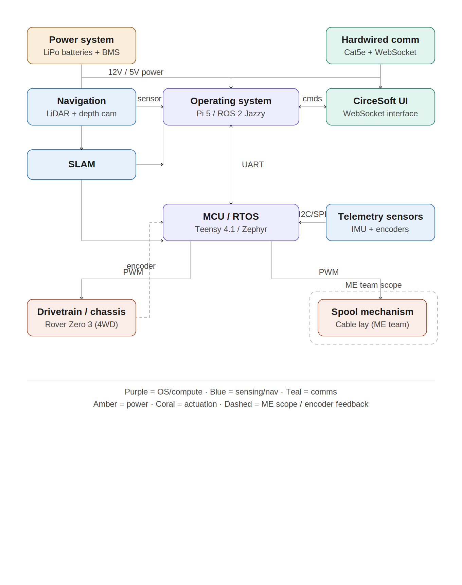
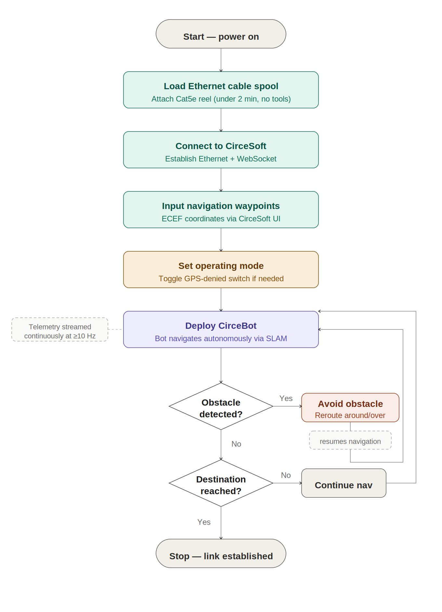
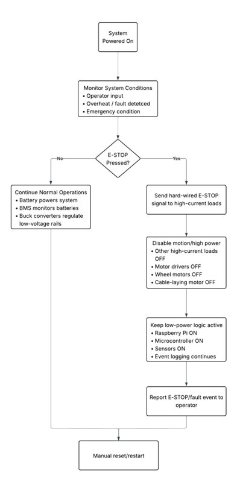
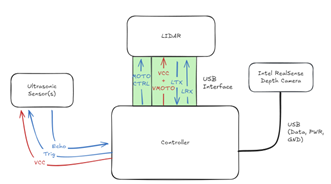
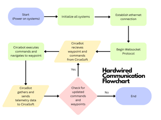
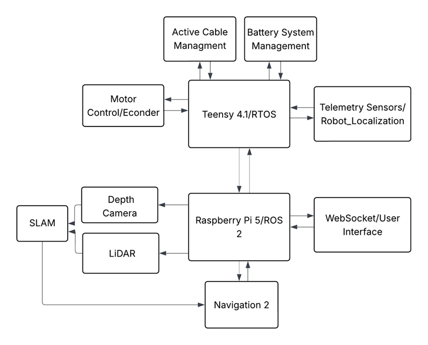
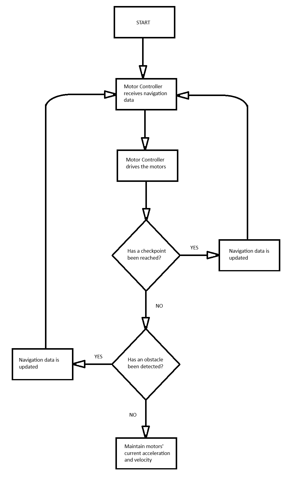
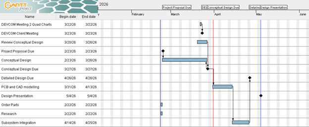

# Conceptual Design: Cable Installation Robot for Contested Environments (CIRCE)

**Gerardo Ramirez, Daniel Davis, Brady Harkleroad, Summer Morris, Nick Romsdal, Sharif Zahra**  
ECE 4961 — Capstone Design 1  
Tennessee Technological University  
March 31st, 2026  

---

## I. Introduction

In modern military and defense operations, maintaining reliable communication is essential for effective command and control. In contested environments, however, radio frequency (RF) communications may be disrupted or rendered unreliable, creating the need for alternative methods to establish secure and continuous connectivity.

The Cable Installation Robot for Contested Environments (CIRCE) is a semi-autonomous robotic system engineered to deploy Ethernet cables and restore communication links while reducing risk to personnel. CIRCE is composed of three primary components: CirceBot, the robotic platform responsible for physical cable deployment; CirceSoft, the path-planning software that governs navigation and movement; and a hardline communication interface, which enables telemetry transmission and system control independent of RF signals.

Engineered for operation in GPS-denied environments, CIRCE enables accurate cable placement while maintaining secure, uninterrupted communication. The system autonomously navigates to designated waypoints, deploys up to 100 meters of Ethernet cable, and sustains real-time telemetry with CirceSoft. Through the integration of advanced navigation methods, semi-autonomous control, and a reliable cable management system, CIRCE improves operational efficiency and delivers a resilient communication solution in contested environments.

---

## II. Restating the Fully Formulated Problem

The establishment of reliable communication networks is a cornerstone of modern military operations. In conventional scenarios, wireless radio frequency (RF) communications provide flexibility and speed for effective coordination. However, adversaries are actively developing capabilities to intercept and jam these signals, creating a "silent battlefield" where command and control (C2) capabilities are degraded, and units lose the ability to coordinate operations, share intelligence, or maintain situational awareness [1]. To combat this degradation in frequency-contested environments, hardwired ethernet cable becomes the necessary alternative to establish jam-resistant communication that cannot be interfered with by adversaries. However, establishing these hardwired connections currently requires personnel to manually lay communication lines through contested zones, exposing military personnel to enemy fire, improvised explosive devices (IEDs), and unnecessary combat danger. Based on the needs of the U.S. Army Combat Capabilities Development Command (DEVCOM), the Cable Installation Robot for Contested Environments (CIRCE) system addresses this critical capability gap by autonomously deploying communication cables in hostile environments, eliminating personnel risk while restoring reliable C2 communications.

The U.S. Army requires unmanned systems capable of entering high-risk zones to remove personnel exposure during communication infrastructure deployment. The CIRCE system must operate independently to keep military personnel out of danger while traversing contested areas and deploying hardwired communication cables. The system must navigate to designated waypoints in GPS-denied environments where satellite navigation is unavailable due to jamming or physical obstructions. Because the robot operates in high-risk zones where human intervention is dangerous, it will encounter physical challenges including rough terrain, uneven hills, and obstacles that require robust mobility systems to maintain traction and reach designated locations. The soil's ability to provide traction is limited for small, unmanned ground vehicles (UGVs), and wheel slip can minimize mobility, causing the robot to become immobilized in certain terrain conditions.

The CIRCE system must deploy physical communication lines while traversing complex environments where cables are susceptible to catching on natural or man-made objects. The system requires a spool mechanism capable of deploying communication lines at controlled speeds synchronized with the robot's forward velocity and slack conditions to minimize cable entanglement. If cable deploys too rapidly, it creates excessive tension and slack that the robot must overcome by increasing acceleration, resulting in higher battery consumption and potential cable damage. Conversely, insufficient deployment speed causes the robot to drag cable, increasing pulling tension beyond acceptable limits, and risking cable jacket damage or conductor breaks. The cable management system must maintain proper tension — typically 25 pounds maximum for Cat5e ethernet — while adhering to minimum bend radius specifications of 4–8 times cable diameter to ensure signal integrity [2].

To operate in an RF-contested environment, the robot must utilize the ethernet cable it is deploying as its primary, jam-proof data communication. Telemetry data — including real-time Earth-Centered, Earth-Fixed (ECEF) coordinates, velocity, remaining cable length, heading direction, battery charge status, and hardware error codes — must stream continuously back to the CirceSoft command node via a WebSocket protocol at a standard minimum frequency of 10 Hz. The communication bridge relies on a protocol buffer (`.proto`) specification, specifically the `CirceSoft2CirceBot.proto` and `CirceBot2CirceSoft.proto` definitions, to ensure low-latency C2 and telemetry packets. To achieve full autonomy, the system requires the integration of the mechanical spooling design, real-time sensor fusion for GPS-denied mapping (SLAM), and an operating system architecture capable of executing commands while simultaneously handling high-bandwidth network communications.

The deployment of an autonomous robotic system requires adherence to safety, performance, and engineering standards. The system shall adhere to the following standards:

- **ANSI/TIA-568.2-D:** Ensures proper cable integrity from external factors such as tension and bend radius.
  1. *Maximum Pulling Tension:* Limits pulling tension for unshielded twisted pairs (UTP) copper cables to a maximum of 25 pounds-force (~110 Newtons). [2]
  2. *Minimum Bend Radius:* Limits the cable from being bent beyond a radius of four times its outer diameter. [2]
- **IEEE 1872.2-2021:** Provides a framework to specify the design patterns and system architecture of autonomous robotics. [3]
- **IEEE 1012-2016:** Establishes the minimum requirements and life cycle processes for verifying and validating safety-critical software, hardware, and system interfaces. [4]
- **National Electrical Safety Code (NESC):** Sets the guidelines for the practical safeguarding of workers and the public during the installation, operation, and maintenance of communication lines and electric supply equipment. [5]
- **ANSI/RIA R15.08:** A risk-based safety standard for industrial mobile robots including AMRs and AGVs, requiring quantitative validation of safety through calculations, testing, and performance criteria.

---

## III. Comparative Analysis of Potential Solutions

### A. Obstacle Detection

#### LiDAR (Light Detection and Ranging)
LiDAR systems were considered for their 360-degree horizontal field of view (FOV), high sampling speed, and ability to detect obstacles at longer distances [6]. Though computationally heavy, LiDAR's high angular resolution and low sampling duration make it an excellent sensor type for dynamic environments where visibility and obstacle position can vary. One issue that became apparent when researching LiDAR systems was the relatively narrow vertical FOV found on 2D LiDARs. For this issue, 3D LiDAR systems were briefly considered before determining the price tag and complexity far outweighed the benefits for the scope of this project. Regarding 2D LiDAR, many sensor products have a measurable distance range of approximately 0.6–12 meters (2–39 feet) [6], allowing CirceBot to detect and navigate around large obstacles safely.

#### Stereo Vision (Camera)
To pick up where LiDAR fails at distances less than 1 meter from the robot, stereo vision cameras were considered. Taking advantage of their large FOV, cameras allow detecting obstacles below the viewing plane of the LiDAR that may threaten the robot's mobility. Reliability and accuracy degrade significantly under low light conditions such as operating at night or in shaded areas. This limitation may be addressed by incorporating a light source on the robot to illuminate the region of interest viewed by the camera. Other factors to consider include excessively high processing time for successive images, performance increases when the environment is known, and high power consumption when processing photos. Despite these concerns, stereo vision's ability to detect obstacles at short range make it a candidate for including in the obstacle avoidance package for CirceBot.

#### IR Sensors
For short-range and low-power-consumption sensing, infrared (IR) sensors were considered. IR sensors emit and receive IR light as a low-cost short-range obstacle detection method in varying lighting conditions. However, IR sensing is heavily dependent on the reflectivity of the object in front of the sensor, with lighter colored objects being more visible to IR than darker objects. Coupled with their smaller detecting range, IR sensors will more than likely not be implemented into the final prototype.

#### Ultrasonic Sensors
Ultrasonic sensors have also been considered as another option for a short-range, low-cost sensor. As opposed to light-based sensors, ultrasonic sensors can operate in low visibility environments regardless of the target's physical appearance or composition. However, high winds, temperature, and environmental noise can all impact accuracy. As these noise sources may be manageable through digital signal processing, ultrasonic sensors will be heavily considered for short-range, rapid obstacle detection.

### B. Localization Method

When working under GPS-denied constraints, the robot must rely on dead reckoning navigation starting at C2 to guide itself to the next waypoint, confined to approximately within a 100-meter radius of C2 as outlined by the customer specifications.

#### Local Level Navigation (LLN) Frame
At a local scale in determining waypoints, a Local Level Navigation (LLN) navigational solution fixes the origin of the coordinate system to the center of mass of CirceBot. With the origin moving with CirceBot, CirceBot can adapt to obstacles that may obstruct its intended path while still reaching the designated waypoint. Should CirceBot be operated closer to the North and/or South poles, the LLN system may become unstable due to polar singularity.

#### Local Tangent Plane (LTP)
Unlike the LLN, a Local Tangent Plane (LTP) affixes the origin to a location on Earth chosen by the navigational solution. For CirceBot, this would be where CirceBot is powered on at C2. Beyond the origin location, LTP orients the z-axis as up and down relative to Earth's surface. LTP also allows the x-axis and y-axis to be aligned with either topographical directions or environmental features such as roads and buildings.

#### Earth Centered Earth Fixed (ECEF) Frame
Often applicable for long range GPS-enabled navigation, an Earth Centered Earth Fixed (ECEF) reference frame can be applied to UGVs, albeit with generally smaller values on all three axes. ECEF uses reference points fixed relative to the origin located at the Earth's center of mass, remaining accurate at a global scale regardless of latitude. However, because the coordinate system's typical scale encompasses the entire Earth, path planning over the scale CirceBot operates in may prove ECEF too complicated for general use. Coordinates in ECEF may become inaccurate due to rounding errors when running calculations. Furthermore, the z-axis for ECEF is parallel to the Earth's spin axis, which follows a circle approximately 15 meters in radius at the north pole. Thus, this system may only be considered as an intermediary coordinate system before being transformed into a local navigational solution to be processed by CirceBot.

#### Earth Centered Inertial (ECI) Frame
As the name implies, the Earth Centered Inertial (ECI) frame does not accelerate or rotate from the perspective of the universe. From this, the Earth's rotation about its spin axis is nonnegligible and coordinates can change over time despite not physically moving relative to Earth. Similarly to ECEF, ECI uses the same z-axis, making it susceptible to polar motion.

#### Trade Table — Coordinate System

| Coordinate System | | Determining Waypoints (0.30) | Minimal Error Propagation (0.45) | Sensor Integration (0.25) | Total (5.0) |
|---|---|---|---|---|---|
| GPS Enabled | Earth Centered Inertial (ECI) | 2 → 0.60 | 3 → 1.35 | 1 → 0.25 | 2.20 / 5 |
| GPS Enabled | Earth Centered Earth Fixed (ECEF) | 4 → 1.20 | 3 → 1.35 | 3 → 0.75 | 3.30 / 5 |
| GPS Denied | Local Level Navigation (LLN) | 4 → 1.20 | 4 → 1.80 | 2 → 0.50 | 3.50 / 5 |
| GPS Denied | Local Tangent Plane (LTP) | 3 → 0.90 | 2 → 0.90 | 3 → 0.75 | 2.55 / 5 |

The criteria used in the table above reflect important factors weighted based on their perceived impact on project completion and performance. As one of the requirements for this project is to follow successive waypoints, maintaining low error propagation is crucial to ensure CirceBot reaches its intended destination, hence its higher weight at 0.45. The Determining Waypoints category is set at a lower weight than error propagation, as mathematical transformations can be applied to convert values between coordinate systems. Based on the results, Local Level Navigation (LLN) scored highest among GPS-denied options and is selected as the primary coordinate system for CirceBot's navigation. To comply with the customer's requirement of simulating GPS-denied operation, a GPS module necessary to use ECEF will be toggleable, allowing ECEF to serve as an intermediary coordinate system when GPS simulation mode is active.

### C. Power Supply

#### Lithium-Ion Battery
Lithium-ion batteries were considered due to their high energy density relative to their size and weight, which is critical for a mobile robotic platform [7]. The batteries deliver strong power with efficient support for both continuous and peak currents without significant voltage sag, and exhibit relatively low self-discharge rates and high cycle life. A downside is their cost, and they require a carefully designed power distribution system to function safely and efficiently. **Score: 4/5.**

#### Nickel-Metal Hydride (NiMH) Battery
NiMH batteries offer improved thermal stability and lower risk of thermal runaway compared to lithium-ion batteries [8]. They are widely available and cost-effective, especially for prototypes. However, they tend to have lower overall efficiency, higher self-discharge rates, lower energy density, and are heavier. **Score: 3/5.**

#### Lead-Acid Battery
Lead-acid batteries are known for their high reliability and well-established technology, as well as their capability to supply large bursts of current [9]. However, their low energy density means they are heavy and bulky, and their shorter cycle life leads to reduced capacity over time. **Score: 2/5.**

#### Trade Table — Power Supply

| Battery Type | Energy Density (0.25) | Weight & Size (0.20) | Power Delivery (0.20) | Safety (0.15) | Cost (0.10) | Integration (0.10) | Total Score |
|---|---|---|---|---|---|---|---|
| Lithium-ion | 5 → 1.25 | 5 → 1.00 | 5 → 1.00 | 3 → 0.45 | 2 → 0.20 | 3 → 0.30 | 4.20 / 5 |
| NiMH | 3 → 0.75 | 3 → 0.60 | 3 → 0.60 | 4 → 0.60 | 4 → 0.40 | 4 → 0.40 | 3.35 / 5 |
| Lead-Acid | 2 → 0.50 | 1 → 0.20 | 4 → 0.80 | 4 → 0.60 | 5 → 0.50 | 5 → 0.50 | 3.10 / 5 |

### D. Power Conversion

#### Buck Converter (Non-Isolated)
A standard non-isolated buck converter was considered due to its efficiency, simplicity, and compact implementation [10]. Standard buck converters are well suited for communication systems, microcontrollers, and sensors. However, they do not provide electrical isolation, meaning noise and voltage surges from high-power subsystems can affect sensitive electronics. **Score: 4/5.**

#### Isolated Buck Converter
Isolated buck converters separate power differences between the input source and the load output via a transformer-based topology, protecting low-voltage electronics from electrical noise and ground loop interference [11]. They are ideally used in electrically noisy environments, but are more expensive and tend to have lower efficiency. **Score: 3/5.**

#### Synchronous Buck Converter
Synchronous buck converters replace the diode with a controlled MOSFET, greatly improving efficiency at higher current levels by reducing conduction losses [12]. They are best used for battery-powered systems where power efficiency is crucial but require more complex circuitry and careful design. **Score: 5/5.**

#### Trade Table — Power Converters

| Converter Type | Efficiency (0.25) | Complexity (0.20) | Cost (0.15) | Noise Isolation (0.15) | Integration (0.10) | Thermal Performance (0.15) | Total Score |
|---|---|---|---|---|---|---|---|
| Synchronous Buck | 5 → 1.25 | 3 → 0.60 | 3 → 0.45 | 2 → 0.30 | 4 → 0.40 | 5 → 0.75 | 3.75 / 5 |
| Non-Isolated Buck | 4 → 1.00 | 5 → 1.00 | 5 → 0.75 | 1 → 0.15 | 5 → 0.50 | 4 → 0.60 | 4.00 / 5 |
| Isolated Buck | 3 → 0.75 | 2 → 0.40 | 2 → 0.30 | 5 → 0.75 | 3 → 0.30 | 3 → 0.45 | 2.95 / 5 |

### E. Ethernet Cable Types

#### CAT5e
CAT5e is one of the more popular ethernet cable types, capable of supporting 1 Gbps with a maximum frequency of 100 MHz. CAT5e cable tends to be flexible enough for several different applications and is typically on the cheaper side and easy to procure [13]. CAT5e would be ideal for this project, as the specifications are well within the project scope.

#### CAT6
CAT6 ethernet cables can support 10 Gbps and frequencies up to 250 MHz, though speeds tend to drop at longer cable lengths. CAT6 tends to be stiffer and less flexible than other ethernet cable types due to the internal shielding, and tends to be more expensive [13]. Although the specifications of CAT6 are within scope, the minimal flexibility and higher cost make this ethernet type less ideal.

#### Trade Table — Ethernet Cable Types

| Type | Flexibility (0.25) | Speed (0.15) | Cost (0.35) | Durability (0.25) | Total (1.0) |
|---|---|---|---|---|---|
| CAT5e | 4 → 1.00 | 3 → 0.45 | 5 → 1.75 | 3 → 0.75 | 3.95 / 5 |
| CAT6 | 3 → 0.75 | 4 → 0.60 | 2 → 0.70 | 4 → 1.00 | 3.05 / 5 |

### F. Drivetrain Platform

Three alternative platforms were evaluated alongside the Rover Robotics 4WD Rover Zero 3 to determine the most suitable drivetrain for the CIRCE system.

The Rover Pro and Scout 2.0 platforms are designed for more extreme environments, offering higher durability and better terrain handling. However, both systems introduce significantly higher cost and complexity than required for CIRCE. These platforms are better suited for long-term deployment or harsh weather conditions, which are not the primary focus of this project.

The Leo Rover provides a smaller and more flexible research platform, with strong software support and ease of development. However, its limited payload capacity of 5 kg and reduced terrain capability make it unsuitable for carrying and deploying Ethernet cable in contested environments.

The Rover Zero 3 provides a balance between performance, cost, and simplicity. It offers sufficient payload capacity and terrain capability while maintaining a lower cost and easier integration with existing systems. It meets all requirements for the CIRCE system without adding unnecessary complexity.

| Attributes | Rover Zero 3 | Rover Pro | Leo Rover | Scout 2.0 |
|---|---|---|---|---|
| Cost | ~$4,000 | ~$9,200 | ~$5,200 | ~$14,000 |
| Payload Capacity | 50 kg | High | 5 kg | High |
| Terrain Capability | Good | Excellent | Good | Excellent |
| Drive Type | 4WD | 4WD | 4WD | 4WD |
| Complexity | Moderate | Moderate | Low | High |
| Durability | Moderate | High | Moderate | Very High |
| Suitability for CIRCE | Strong | Overkill | Not suitable | Overkill |

### G. Operating System

Designing the operating system subsystem requires analysis to ensure the selected software, hardware, and communication protocols can successfully meet the specifications of the CIRCE platform. The analysis focuses on three critical architectures: the selection of the Single Board Computer (SBC) and microcontroller unit (MCU), and the selection of the Robot Operating System 2 (ROS 2) distribution for the SBC.

#### ROS Middleware

For CIRCE to operate autonomously in contested environments, the system requires an operating system capable of executing sensor fusion, spatial mapping, and path planning, alongside a middleware framework that governs inter-process communication and robotic autonomy. The middleware framework required to drive the autonomous behavior of CIRCE is Robot Operating System 2 (ROS 2). ROS 2 is a tool used to simplify the development of robotics. It provides standardized communication mechanisms, data transport, and node lifecycle management. The implementation of ROS is based on the kernel version of the SBC. Selecting the appropriate ROS 2 version is constrained by the hardware requirements of the SBC and the official target platforms defined by the ROS Enhancement Proposal 2000 (REP-2000) [16]. Different Linux kernels and ROS versions are to be evaluated for three system criteria:

1. **Reliable Publisher/Subscriber Communication:** The middleware must reliably publish and subscribe nodes to topics, ensuring message delivery between sensor, planning, and control nodes that compose CIRCE's autonomy stack.
2. **Autonomy Stack Package Support:** The middleware must reliably support the core autonomy stack required by CIRCE, including sensor fusion, robot localization, 2D mapping, path planning, and coordinate frame management.
3. **Language Standards and Native Kernel Compatibility:** The middleware must support modern versions of C++ and Python, and the OS kernel version of the SBC must natively support the corresponding version of the middleware without the use of docker containerization or virtualization.

There are two distributions of ROS 2, Humble and Jazzy. Both ROS 2 distributions are built on a publisher/subscriber messaging method, where nodes communicate by publishing messages to other nodes and subscribing nodes to topics to receive messages of interest. For CIRCE, this method governs all nodes' data flow: LiDAR drivers publish point clouds, IMU drivers publish inertial measurements, the localization node publishes pose estimates, the SLAM node publishes occupancy grids, and the navigation stack publishes velocity commands. Therefore, it must reliably handle the registration, discovery, and delivery of topic messages between concurrent nodes without loss or delivery failure.

ROS 2 Humble and Jazzy use Data Distribution Service (DDS) for publisher/subscriber communication [32, 33]. Both distributions implement the ROS Middleware (RMW) abstraction layer, which sits between the ROS 2 client libraries and the actual DDS vendor implementation. The default RMW implementation in both distributions is eProsima Fast DDS [33]. The differences are in how the ROS 2 layer interacts with DDS. Humble introduced Content-Filtered Topics, a DDS feature that lets subscribers specify a filter expression so they only receive messages whose content matches the predicate — a DDS optimization where filtering happens at the publisher or in the middleware before serialization [32]. In Jazzy, the executor's interaction with DDS has improved, efficiently polling for new data or events without throttling the CPU [33]. For CIRCE to operate as intended, nearly all of its publishers/subscribers feed from multiple topics.

CIRCE's software stack requires C++ for low-level control algorithms and Python for higher-level planning and integration. Both Humble and Jazzy require a minimum of C++17 as the C++ language standard [32, 33]. For Python, Humble requires Python 3.10 (default on Ubuntu 22.04 LTS), while Jazzy requires a minimum of Python 3.8 but is built and distributed for Python 3.12 (default on Ubuntu 24.04 LTS) [32, 33]. The Linux kernel version shipped with the SBC's operating system must natively support ROS 2 distribution's APT packages, eliminating the need for docker containerization, which would introduce latency overhead, real-time scheduling issues, and system complexity that could cause issues with CIRCE's autonomy.

Additionally, both Humble and Jazzy offer the full package to drive the CIRCE system fully autonomously. These packages are as follows:

1. **robot_localization:** A non-linear state estimation package that fuses data from multiple sensors using an Extended Kalman Filter (EKF) or Unscented Kalman Filter (UKF). [35]
2. **slam_toolbox:** A 2D Simultaneous Localization and Mapping library that builds an occupancy grid map of the environment. [34]
3. **nav2:** Provides path planning, obstacle avoidance, behavior trees, and waypoint following. [36]
4. **tf2:** The coordinate frame transform library, providing time-stamped spatial relationships between all reference frames in the robot — sensor frames, body frames, odometric frames, and map frames.

| Feature | ROS 2 Humble Hawksbill | ROS 2 Jazzy Jalisco |
|---|---|---|
| Release Date & Status | May 2022 (Stable LTS) | May 2024 (Latest LTS) |
| End of Life (Support Lifecycle) | May 2027 | May 2029 |
| Target Operating System (REP-2000) | Ubuntu 22.04 LTS (Jammy Jellyfish) | Ubuntu 24.04 LTS (Noble Numbat) |
| Ubuntu Kernel | Linux 5.15 LTS | Linux 6.8 |
| Language Standards Compliance | Python 3.10, C++17 | Python 3.12, C++20 |

Both Humble and Jazzy satisfy all three criteria. However, Jazzy is preferred on the first and third criteria where its architectural improvements directly serve CIRCE's long-term operational requirements. Jazzy provides the full DDS publisher/subscriber architecture from Humble and improves executor efficiency. Data race conditions in executors that were present in prior releases have been resolved in Jazzy, improving multithreaded reliability [33]. For CIRCE's high node count, these executor improvements reduce scheduling overhead and provide more deterministic message delivery. Additionally, Jazzy's pairing with Ubuntu 24.04 LTS with Python 3.12 and the Linux 6.8 kernel provides improved real-time scheduling and broader modern SBC hardware support.

#### Single Board Computer (SBC): Raspberry Pi 5 vs. NVIDIA Jetson Nano

Selecting the primary SBC dictates the capabilities of the high-level operating system and the system's ability to process complex environmental data. For the CIRCE platform to meet its specifications, the SBC must actively manage data streams from LiDAR and Intel RealSense Depth Camera with IMU, and simultaneously manage the Robot Operating System (ROS) distribution. To determine the optimal hardware, the Raspberry Pi 5 and NVIDIA Jetson Nano are evaluated for three system criteria:

1. **Computational Power:** The SBC must process CPU-bound ROS 2 packages — rplidar, realsense, slam_toolbox, nav2, and robot_localization (sensor fusion) — to make fast decisions for navigation and obstacle detection.
2. **Software Architecture:** The SBC must support bare-metal execution of a modern OS such as Linux Ubuntu 24.04 LTS to ensure compatibility with the ROS 2 packages.
3. **Peripheral Integration:** The board must include high-bandwidth I/O interfaces such as USB 3.0/2.0 to reliably receive depth and point cloud data from the RealSense camera and LiDAR readings without causing CPU bottlenecks.

The Raspberry Pi 5 utilizes a quad-core ARM Cortex-A76 processor operating at 2.4 GHz with 8 GB of RAM. This high clock speed and memory provide single-thread and multi-thread processing power, which is required to compute complex ROS 2 algorithms such as SLAM and Nav2 since they are heavily CPU-bound. It is also equipped with a 12-core VideoCore VII GPU operating at 800 MHz, but the task required to operate the CIRCE platform is CPU-intensive. The Pi 5 natively supports modern Linux distributions like Ubuntu 24.04 LTS, allowing bare-metal installation of ROS 2 packages. It also features dual USB 3.0 ports sufficient for RealSense camera and LiDAR data streaming.

The NVIDIA Jetson Nano kit focuses primarily on AI and deep learning workloads, utilizing a 128-core NVIDIA Maxwell GPU capable of 472 GFLOPS of native AI performance. However, its central processor is an older quad-core ARM Cortex-A57 operating at 1.43 GHz with 4 GB of RAM. The Jetson Nano does not support newer Ubuntu versions such as the required Ubuntu 24.04 LTS to run ROS 2. To operate ROS 2 on the Nano kit, docker containerization is required. The Jetson Nano offers better GPU performance than the Pi 5, but the Linux version required to run the ROS 2 packages is not supported unless a docker is implemented.

Since ROS 2 middleware involves passing messages between nodes using DDS, managing node lifecycle, allocating memory, and handling the network stack, the core navigational capabilities of the CIRCE system rely entirely on CPU performance. The Nano's CPU is slower than the Pi 5's, which could cause a bottleneck. Not only is it slower, but the Nano has half as much RAM as the Pi 5. When processing SLAM and navigation, more memory is required for the CPU to render its environmental map and perform path planning simultaneously. The Pi 5's 8 GB of LPDDR4X RAM provides the necessary headroom. Overall, the Raspberry Pi 5 supplies the necessary raw CPU performance to run ROS 2 packages while simultaneously communicating with peripherals.

| Feature | Raspberry Pi 5 | NVIDIA Jetson Nano Dev Kit |
|---|---|---|
| Processor (CPU) | Quad-core ARM Cortex-A76 @ 2.4 GHz | Quad-core ARM Cortex-A57 @ 1.43 GHz |
| Graphics (GPU) | 12-core VideoCore VII @ 800 MHz | 128-core NVIDIA Maxwell @ 921 MHz |
| Memory (RAM) | Up to 8GB LPDDR4X | 4GB 64-bit LPDDR4 |
| Connectivity | Wi-Fi, Bluetooth, & Ethernet / 2x USB 3.0/2.0 | Ethernet, 5x USB 3.0 |
| AI Performance | External Raspberry Pi AI HAT+ 2 / Up to 40 TOPS | Up to 472 GFLOPS native |

#### Microcontroller Unit (MCU): Teensy 4.1 vs. STM32F407

Motor control and active cable tension management must be properly managed by a microcontroller unit. The MCU acts as the real-time system of the robot, translating velocity commands from the SBC into motor movements while reading motor encoders, exchanging data between the SBC, and sensor polling.

The STM32F407 processor runs at 168 MHz with 192 KB of SRAM, which may not be sufficient for this application given its high bandwidth processing requirements. While cost-effective and equipped with numerous I/O ports, it lacks the processing bandwidth required to concurrently manage hardware interrupts, the motor control loop, and communication with the Pi 5 with minimal latency.

The Teensy 4.1 is powered by an ARM Cortex-M7 processor operating at 600 MHz and can be overclocked if necessary. It includes 1024 KB of RAM and approximately 8 MB of Flash memory. While it has fewer GPIO pins than the STM32F407, it has the right set of ports for this application and outperforms the STM32F407 in raw processing power.

| Feature | Teensy 4.1 | STM32 F407 |
|---|---|---|
| Core Architecture | 32-bit ARM Cortex-M7 with FPU | 32-bit ARM Cortex-M4 with FPU |
| Clock Speed | 600 MHz | 168 MHz |
| RAM (SRAM) | 1024 KB | 192 KB |
| Flash Memory | 7936 KB | 512 KB |
| Total GPIO Pins | 55 | 82 |
| UART/Serial Ports | 8 | 3 |
| SPI Ports | 3 | 3 |
| I2C Ports | 3 | 3 |
| CAN Bus Interfaces | 3 (Includes 1 CAN FD) | 2 |

#### Low-Level OS: Zephyr RTOS vs. Bare Metal Execution
Bare metal programming offers the lowest memory footprint and consistently low interrupt latency, as the application runs directly on the hardware without any intermediate abstractions. While this is ideal for simple, single-purpose applications, the complexity of scheduling concurrent tasks — such as managing communication network stacks with the Pi 5, reading sensors, and executing motor control — rapidly becomes overwhelming without an operating system. Zephyr RTOS provides a highly reusable, deterministic task scheduler and robust inter-process communication primitives such as mutexes and message queues. Because the Teensy 4.1 has 1024 KB of RAM and a 600 MHz clock speed, the minimal overhead introduced by Zephyr is negligible, and it provides the necessary structural framework to reliably run the CIRCE platform.

| Feature | Zephyr RTOS | Bare Metal (No OS) |
|---|---|---|
| Execution Structure | Preemptive and cooperative multithreading via a scheduler. | Single main() infinite loop relying entirely on polling and ISRs. |
| Hardware Abstraction | Extensive, utilizing a standardized Linux-style Device Tree. | None; requires direct register manipulation or vendor-specific HALs. |
| Memory Footprint | Moderate to large due to kernel overhead. | Extremely minimal; only consumes memory for the exact code written. |
| Task Synchronization | Built-in primitives (mutexes, semaphores, message queues). | Must be manually implemented using volatile flags and interrupt masking. |
| Ecosystem & Drivers | Massive library of built-in drivers, networking stacks, and power management. | Requires writing custom drivers for every peripheral and sensor from scratch. |
| Complexity & Scaling | High initial learning curve, but scales exceptionally well. | Simple to start but becomes highly complex and difficult to maintain. |

---

## IV. High-Level Solution

The CIRCE system integrates five electrical subsystems into a cohesive, semi-autonomous platform capable of deploying Ethernet cables in GPS-denied, RF-contested environments. The solution prioritizes mission reliability, personnel safety, and adherence to the specifications set forth by DEVCOM while remaining within the constraints of the available budget and timeline.

At the core of the system is the Rover Robotics 4WD Rover Zero 3, which serves as both the drivetrain and chassis for CirceBot. The platform was selected for its rugged outdoor performance, ROS 2 compatibility, and sufficient payload capacity to carry 100 meters of Cat5e Ethernet cable along with all onboard electronics. A Raspberry Pi 5 running Ubuntu 24.04 LTS and ROS 2 Jazzy Jalisco serves as the high-level computing platform, coordinating sensor fusion, SLAM-based navigation, and communication with the CirceSoft operator interface. A Teensy 4.1 microcontroller running Zephyr RTOS handles all real-time operations including motor control, cable tension management via PWM, and telemetry sensor polling.

Navigation in GPS-denied environments is achieved through the fusion of LiDAR and depth camera data processed through a SLAM algorithm, enabling CirceBot to map its environment and navigate to operator-specified ECEF waypoints without reliance on satellite positioning. Obstacle detection is handled in real time, with the system autonomously rerouting around or over detected obstacles before resuming its assigned path. All navigation commands and telemetry data including position, velocity, remaining cable length, battery status, and error codes are transmitted at a minimum of 10 Hz via WebSocket protocol over the Cat5e Ethernet cable being deployed, ensuring jam-resistant communication throughout the mission.

Power is supplied by two lithium-ion polymer batteries managed by a dedicated Battery Management System. The first battery powers all primary systems including the drivetrain, onboard computing, and sensors, while the second powers the cable-laying mechanism. Non-isolated buck converters regulate voltage for each subsystem, and a hardware E-STOP provides immediate power cutoff to all actuators in the event of an emergency while preserving power to the microcontroller and logging systems.

The cable spool and laying mechanism are designed and fabricated by the Mechanical Engineering team, with the Teensy 4.1 providing PWM-based tension control signals to the spool motor to maintain cable tension within the 25 pounds-force maximum specified by ANSI/TIA-568.2-D. This EE and ME interface is the primary integration point between the two teams and is managed through designated liaisons to minimize the risk of cross-team communication gaps.

This design minimizes risk by leveraging proven platforms, the Rover Zero 3, Raspberry Pi 5, and ROS 2, while addressing the novel integration challenge of autonomous cable deployment in contested environments. Resource utilization is optimized by treating the Rover Zero 3 as a prior-cycle asset and concentrating new procurement within the $1,070 budget ceiling.

### Requirements Traceability

The architecture directly satisfies each specification set forth by DEVCOM. The requirement for GPS-denied navigation is met by the SLAM-based Nav2 stack fusing LiDAR and depth camera data with IMU and wheel odometry, no satellite positioning is required at any point during the mission. The 10 Hz minimum telemetry frequency is satisfied by the ROS 2 Telemetry and Communication Node serializing position, velocity, cable length, battery status, and error codes via WebSocket over the deployed Cat5e cable; this path is entirely hardwired and immune to RF jamming, simultaneously satisfying the RF-contested communication requirement. The 20-minute minimum runtime is addressed by two LiPo batteries independently sized for the drivetrain and spool loads, with a dedicated BMS monitoring both. The 25 lbf maximum cable tension limit per ANSI/TIA-568.2-D is enforced in hardware through ADC feedback from a spool-mounted strain gauge to the Teensy 4.1's PWM control loop, which actively adjusts spool motor speed to stay within tolerance. The 100-meter cable capacity and tool-free reel replacement within 2 minutes are addressed at the ME/EE interface, the EE team's deliverable is a stable PWM tension signal. The ME team's deliverable is a motor-driven spool that responds to it.

### Risk Mitigation

Three primary integration risks have been identified and mitigated in the architecture. First, ME/EE integration risk: the cable spool mechanism is the primary physical interface between the two teams and has been flagged by DEVCOM as a historical failure point in cross-team projects. This risk is mitigated by defining a hard interface contract, PWM signal out from the Teensy 4.1, spool motor response from the ME team, and managing coordination through designated liaisons on a recurring basis. Second, SLAM reliability in outdoor GPS-denied environments: fusing LiDAR, depth camera, IMU, and wheel odometry reduces single-sensor failure exposure, and the ENU/UTM coordinate system bounds all path planning within a local frame that does not depend on satellite signals. Third, budget overrun risk: the Rover Zero 3's transfer as a prior-cycle asset removes $4,000 from the gross cost. The net budget of $986.43 sits $83.57 under the $1,070 ceiling, with power subsystem BMS and E-STOP line items still pending final confirmation, intentionally surfacing that cost uncertainty now rather than during fabrication.

### Hardware Block Diagram

### Operational Flow Chart

---

## V. Atomic Subsystem Specifications

### A. Power System

- CirceBot shall run on two lithium-ion polymer batteries. The first battery shall power most of the robot's systems, including the tracks and motors, the microcontroller, all sensors, and operating systems. The second lithium-ion polymer battery shall power the cable-laying device (assuming the ME team uses the device suggested).
- CirceBot shall require buck converters for different power needs. Three buck converters shall be of different voltages: two at 5.5V (one for the Raspberry Pi, one for the LiDAR and ultrasonic sensor) and one at 3.3V (for the depth sensor and the Teensy 4.1). By implementing a PDM (Power Distribution Module), voltage can be regulated so that each subsystem can distribute different amounts of power to multiple circuits while minimizing the need for a complex system of fuses and relays [18].
- Each subsystem shall have a dedicated fuse connected in series to prevent overcurrent conditions and protect wiring and components [19].
- The CirceBot has four motors, one for each wheel. The motors and motor drivers shall be powered directly from the first battery, as high-current loads require direct connection to the main power bus. Each motor shall be individually protected by a fuse, including the two drivetrain motors (Brushless Dual FSESC4.20 100A Hall Effect Quadrature). Each motor shall have an isolated buck converter implemented in its circuitry to help prevent voltage surges from affecting the operation of other subsystems.
- CirceBot shall have at least one Battery Management System (BMS) to monitor the activity of both batteries. The BMS shall communicate the state of charge (%), state of health, and battery temperature for both batteries back to the system operator to ensure safe operation and prevent overcharge, over-discharge, and thermal faults [20, 21]. The BMS(s) shall have a dedicated fuse implemented in the circuit to prevent overcurrent.
- There shall be a dedicated, easy-access emergency stop (E-STOP) button to cut power to CirceBot's motors by sending a dedicated hard-wire E-STOP signal to the motor drivers, wheel motors, cable-laying motor, and high-current loads. Maintaining power to low-power logic, microcontroller, sensors, and Raspberry Pi to ensure continuous event logging, in accordance with emergency stop safety principles for machinery [22].

### B. Navigation

- As opposed to relying on GPS coordinates and satellites to localize the robot, CirceBot shall locate itself using a local ENU coordinate system paired with UTM map projections to precisely localize itself without relying on satellite signals.
- CirceBot shall track itself within the ENU coordinate system using onboard IMU and onboard wheel rotation tracking.
- CirceBot shall autonomously avoid obstacles using a sensor fusion algorithm to combine LiDAR, depth camera data, and ultrasonic data.

### C. Hardwired Communication

- CirceBot shall send and receive commands at a minimum of 10 Hz.
- CirceBot shall communicate with CirceSoft using standard WebSocket protocol.
- CirceSoft shall send commands in the format supplied in `CirceSoft2CirceBot.proto` to CirceBot.
- CirceBot shall transmit telemetry data in the `CirceBot2CirceSoft.proto` spec to CirceSoft.
- The telemetry data shall include the remaining cable length, last known GPS coordinates, velocity, position, battery status, and error codes.
- CirceBot shall communicate with CirceSoft using the ethernet cable being deployed.
- CirceBot shall carry 100 meters of ethernet cable.
- CirceBot shall be able to operate for a minimum of 20 minutes.

### D. Robot Operating System

The OS subsystem serves as the main system driving the entire CIRCE platform. It is a software architecture consisting of a high-level OS responsible for sensor fusion, mapping, and path planning, and a low-level embedded OS responsible for executing motor control, active cable management, and reading telemetry sensor data.

#### High-Level Operating System and Middleware

Ubuntu 24.04 LTS is utilized to provide the necessary kernel features, advanced memory management, and extensive driver support for complex peripherals like LiDAR and depth camera. Sitting on top of the Linux kernel is ROS 2, which acts as the core middleware framework driving the autonomous behavior of CIRCE. Within ROS 2, the software architecture is divided into discrete nodes:

- The **Sensor Fusion Node** subscribes to the hardware interfaces to ingest raw environmental data. It translates incoming LiDAR data streams into standard `sensor_msgs/LaserScan` or `sensor_msgs/PointCloud2` message formats.
- The **Navigation and Path Planning Node (Nav2)** utilizes the `nav2_costmap_2d` framework to generate detailed mapping based on LiDAR data. It calculates obstacle-free trajectories toward the ECEF waypoints provided by the remote CirceSoft interface.
- The **Telemetry and Communication Node** acts as the gateway to the physical Ethernet tether. It aggregates real-time Cartesian position, velocity vectors, remaining cable length, battery charge status, and hardware error codes, then serializes this data into Google Protocol Buffers to meet the `CirceBot2CirceSoft.proto` specification.

#### Interfaces

- The Raspberry Pi 5 communicates with the Teensy 4.1 via **UART** serial communication, sending high-level velocity and navigation commands as output and receiving low-level telemetry and encoder feedback as input.
- The Raspberry Pi 5 receives sensor data from the LiDAR and depth camera via **USB**, ingesting raw point cloud and depth frame data for the SLAM and navigation nodes.
- The Raspberry Pi 5 communicates with CirceSoft via the deployed Cat5e Ethernet cable using the **WebSocket** protocol, transmitting serialized telemetry data in the `CirceBot2CirceSoft.proto` format and receiving navigation waypoints and commands in the `CirceSoft2CirceBot.proto` format at a minimum frequency of 10 Hz.

#### Low-Level Real-Time Operating System (RTOS)

The Teensy 4.1 microcontroller runs Zephyr RTOS to guarantee deterministic execution across concurrent tasks:

- **UART** is dedicated to maintaining high-speed communication of commands and telemetry between the Teensy 4.1 and the Raspberry Pi 5.
- **PWM** is utilized by the motor control loops to govern the locomotion drive motors and the active cable spool motor.
- **ADC** actively monitors analog voltage feedback from the spool-mounted strain gauge or load cell, translating physical pulling tension into digital values to ensure the tether remains below the 25 pounds-force pulling tension limit specified by ANSI/TIA-568.2-D.
- **I2C and SPI** are used for high-frequency polling of onboard telemetry sensors and battery voltage monitoring.
- **Hardware Interrupts via GPIO** are assigned the highest execution priority to handle emergency events such as triggering the system to a halt upon detecting cable snags and reading high-frequency encoder pulses for odometry.

#### OS Shall Statements

- The operating system subsystem shall run Ubuntu 24.04 LTS and ROS 2 Jazzy Jalisco natively on the Raspberry Pi 5 without virtualization or containerization.
- The OS shall implement a Sensor Fusion Node capable of processing LiDAR and depth camera data into standard ROS 2 message formats including `sensor_msgs/LaserScan` and `sensor_msgs/PointCloud2`.
- The OS shall implement a Navigation and Path Planning Node using the Nav2 framework to calculate obstacle-free trajectories to operator-specified ECEF waypoints.
- The OS shall implement a Telemetry and Communication Node that serializes and transmits telemetry data to CirceSoft at a minimum frequency of 10 Hz via WebSocket protocol over the deployed Ethernet cable.
- The OS shall receive navigation waypoints and commands from CirceSoft in the `CirceSoft2CirceBot.proto` format and transmit telemetry in the `CirceBot2CirceSoft.proto` format.
- The Teensy 4.1 shall run Zephyr RTOS to provide deterministic scheduling of motor control, sensor polling, and communication tasks.
- The RTOS shall manage UART communication between the Teensy 4.1 and the Raspberry Pi 5 for command and telemetry exchange.
- The RTOS shall generate PWM signals to control the drivetrain motors and the cable spool motor.
- The RTOS shall read ADC feedback from the cable tension sensor and maintain spool tension below 25 pounds-force as specified by ANSI/TIA-568.2-D.
- The RTOS shall poll telemetry sensors via I2C and SPI at sufficient frequency to maintain accurate state estimation.
- The RTOS shall assign hardware interrupts the highest execution priority for emergency stop events and encoder pulse reading.

### E. Drivetrain

The drivetrain for CIRCE is based on the Rover Robotics 4WD Rover Zero 3 platform, which provides a rugged and reliable foundation for operation in outdoor and uneven environments. The platform uses two brushless motors to drive all four wheels through a tracked drivetrain, allowing for stable movement and improved traction across rough terrain. The Rover Zero 3 offers similar functionality to higher-end platforms at a lower cost, making it a practical choice for this application.

- The platform has a height of 25.4 cm, a width of 39 cm, a length of 62 cm, and a ground clearance of 7.9 cm.
- The platform weighs 11 kg.
- The platform is driven by four 24V DC motors with a max power output of 80W/motor.
- The platform is capable of carrying a max weight of 50 kg.
- The platform is capable of an approximate runtime of 3 hours and is integrable with the ROS 2 platform.
- The platform costs $4,000 before tax.
- The microcontroller will communicate with the motors to determine the speeds and torque needed to follow the designated path.

#### Drivetrain Shall Statements

- The drivetrain shall use the Rover Robotics 4WD Rover Zero 3 as the base platform.
- The drivetrain shall be driven by four 24V DC motors with a maximum power output of 80W per motor.
- The drivetrain shall maintain a minimum ground clearance of 7.9 cm to traverse uneven terrain.
- The drivetrain shall support a maximum payload capacity of 50 kg.
- The drivetrain shall receive velocity and directional commands from the Teensy 4.1 via PWM signals.
- The drivetrain shall transmit encoder feedback to the Teensy 4.1 via GPIO to support odometry calculations.
- The drivetrain shall support native integration with the ROS 2 platform for autonomous motor control.
- The drivetrain shall be capable of operating for a minimum of 20 minutes under full load on the onboard power supply.
- The drivetrain shall be capable of navigating outdoor uneven terrain without becoming immobilized.

### F. M.E. Team Systems

The cable spool and laying mechanism are designed and fabricated entirely by the Mechanical Engineering team. The ME team's scope encompasses the mechanical design, fabrication, and integration of the cable deployment hardware, managed entirely within the ME team's budget. The Teensy 4.1 provides PWM-based tension control signals to the spool motor as the primary EE–ME interface point.

---

## VI. Ethical, Professional, and Standards Considerations

### A. Broader Impacts

The team will take into consideration ethics, standards, and constraints when designing and implementing the CirceBot. This project will have impacts on various aspects of culture, society, the environment, public health, public safety, and the economy.

**Societal trust and overall culture of robots:** Robots are able to increase productivity and safety among humans [23]. The CirceBot shall be designed such that less risk is involved for humans in contested environments, which will aid in the positive relationship between robots and humans.

**Effect of batteries on the environment:** Heavy metals such as lead, mercury, nickel, cadmium, zinc, lithium, and manganese can leach into the surrounding soil and groundwater when batteries are not properly disposed of [24]. Special care will be taken to ensure any batteries needing disposal are properly handled.

**Consideration of material waste on the environment:** Special care shall be given when designing this project to ensure materials are used with intention, minimizing this project's negative impact on the environment.

**Increased safety and health of humans:** Rather than putting humans at risk when reestablishing communication in a contested environment, CirceBot shall autonomously install the cable, reducing the risk of injury or exposure to enemy threats and environmental hazards.

**Decreased burden on the economy:** The cost of a human soldier is approximately $50,000 to $100,000 in the United States [25]. CirceBot shall reduce those costs as humans will undergo less risk in contested environments, with savings realized on deployment, training, and medical expenses.

**Opportunities for economic growth:** This project requires knowledge across several different disciplines, creating more opportunities for employment in computer science, electrical engineering, and mechanical engineering.

### B. Standards

**Standards Considerations for Ethics:** The IEEE Code of Ethics will be used to ensure any work performed on CirceBot is done with the highest ethical and professional conduct [26]. Decisions will be made such that the safety, health, and welfare of the public is prioritized over performance, cost, or convenience. The IEEE Code of Ethics will influence decisions regarding component selection, design choices, and the safety protocols put in place for CirceBot. All work on this project shall be done in honesty, transparency, and by following best practices, with proper credit given to all contributions.

**Standards Considerations for Power Systems:** The design of CirceBot's power system shall follow industry standards to ensure correct operation, reliability, and safety while navigating CirceBot in a Tennessee environment. Battery systems and energy storage components shall follow IEEE standards for rechargeable battery systems [27]. This ensures proper monitoring of the state of charge, state of health, and temperature. The battery management system (BMS) shall report state of charge and temperature within reasonable accuracy. The IEEE standards for rechargeable battery systems will guarantee the batteries are properly designed, tested, and integrated into CirceBot to maintain safety and reliability. Lithium-ion battery shall follow UL 2271 and IEC 62133 guidelines to protect against overcharge, over-discharge, and short-circuit conditions [20, 21]. The system shall prevent the batteries voltage exceeding manufacturer ratings and shall disconnect loads during fault conditions. Tests will be conducted to confirm automatic shutdown during controlled overcharge and short-circuit experiments. System integration, electrical wiring, and overcurrent protection shall follow NFPA 70 (National Electrical Code) to ensure safe power distribution [19]. All conductors shall be rated for at least 125% of maximum current, and each subsystem shall include appropriately rated fuses. All DC converters shall be rated at 2 times the nominal continuous power consumption. Wire gauges and fuse ratings will be implemented accordingly based on calculated load currents during system integration. The E-STOP (emergency stop) system shall be implemented to ensure immediate power removal from all motion-producing subsystems, in accordance with ISO 13850 standards, to maintain safe system performance [22]. The E-STOP shall disable all motors and high-current loads within 100 ms of activation. Response time will be measured using an oscilloscope. Also, safety conditions shall follow ISO 12100 for risk assessment and OSHA guidelines for safe operation of electrical and mechanical systems [28, 29]. All identified hazards (electrical, mechanical, thermal) shall have corresponding preventive measures implemented. Therefore, these standards shall ensure the power system of CirceBot meets implemented engineering practices for safety, performance, and reliability.

**Standards Considerations for Hardwired Communication:** The standards for ethernet communication shall be defined by IEEE 802.3 and ANSI/TIA 568 [30, 31]. IEEE 802.3 defines the allowable data rates, signaling methods, and electrical characteristics that govern cable and protocol selection; it specifies bandwidths for CAT5e up to 1 Gbps at cable lengths up to 100 meters, ensuring CirceBot can sustain the required 10 Hz telemetry rate with CirceSoft in RF-contested environments. ANSI/TIA-568 shall be used to ensure correct pin layout, connector type, and cable termination; the standard specifies a maximum twisted-pair cable length of 100 meters, which matches the exact length CirceBot deploys, as cable lengths beyond this limit face signal degradation that would require additional network hardware.

### C. Constraints

- The CIRCE system must operate in tactically contested environments where RF-based communications may be jammed, monitored, or unreliable, requiring a hard-wired Ethernet connection between CirceBot and CirceSoft.
- The CIRCE system must operate in GPS-denied environments, requiring alternative methods of navigation and path following.
- Power management is critical, with a minimum required operation time of 20 minutes on an independent power source.
- The system must properly handle and deploy Ethernet cable during operation, maintaining acceptable tension and avoiding damage such as excessive bending or tangling.
- The robot must complete its mission without external assistance once deployed.

---

## VII. Resources

### CIRCE Master Budget — EE Team

| Subsystem | Item | Qty | Unit Cost | Subtotal | Notes |
|---|---|---|---|---|---|
| *Power system — Brady* | | | | | |
| Power | Battery pack | 1 | $60.00 | $60.00 | Brady's confirmed price |
| Power | Buck converters | 3 | $10.00 | $30.00 | Brady's confirmed price |
| Power | Fuses | 12 | $4.17 | $50.00 | Brady's confirmed price |
| Power | Diodes | 10 | $2.00 | $20.00 | Brady's confirmed price |
| Power | BMS | 1 | — | TBD | Not listed in Brady's BoM; pending confirmation |
| Power | E-STOP button | 1 | — | TBD | Not listed in Brady's BoM; pending confirmation |
| **Power subtotal** | | | | **$160.00** | BMS and E-STOP pending Brady confirmation |
| *Hardwired communication — Summer* | | | | | |
| Comm | Ethernet to USB adapter | 1 | $12.00 | $12.00 | |
| Comm | Rotatable Ethernet extender | 1 | $10.00 | $10.00 | ✓ Have |
| Comm | Crimping kit | 1 | $28.00 | $28.00 | |
| Comm | Cat5e Ethernet cable (100 m) | 1 | $120.00 | $120.00 | Plenum-rated 1000 ft spool |
| **Comm subtotal** | | | | **$170.00** | |
| *Operating system — Sharif & Gerardo* | | | | | |
| OS | Raspberry Pi 5 (8 GB) | 1 | $172.72 | $172.72 | ✓ Have |
| OS | Teensy 4.1 | 1 | $31.50 | $31.50 | |
| OS | USB Hub 4-port 480 Mbps | 1 | $111.14 | $111.14 | ✓ Have |
| **OS subtotal** | | | | **$315.36** | |
| *Navigation — Nick* | | | | | |
| Nav | LiDAR sensor | 1 | — | — | ✓ Have |
| Nav | Depth camera (Intel RealSense) | 1 | — | — | ✓ Have |
| Nav | A02YYUW Ultrasonic sensor | 4 | $17.88 | $71.52 | Short-range obstacle detection |
| Nav | USB-C to USB-A data cable | 1 | $8.49 | $8.49 | For Intel RealSense depth camera |
| Nav | GPS waterproof antenna | 1 | $10.99 | $10.99 | GPS simulation mode support |
| Nav | GPS module | 1 | $11.39 | $11.39 | GPS simulation mode support |
| Nav | Miscellaneous (unforeseen) | 1 | $30.00 | $30.00 | Buffer for unexpected nav components |
| **Nav subtotal** | | | | **$132.39** | |
| *Drivetrain / chassis — Daniel* | | | | | |
| Drivetrain | Rover Zero 3 (4WD platform) | 1 | $4,000.00 | $4,000.00 | ✓ Have · Transferred from ME dept. prior cycle. Included in gross total only |
| **Drivetrain subtotal** | | | | **$4,000.00** | Included in gross total only |
| *Mechanical — ME team* | | | | | |
| ME | Spool / cable laying mechanism | — | — | — | Managed entirely by ME team budget |
| *Prototyping & miscellaneous* | | | | | |
| — | PETG filament | 1 | $24.64 | $24.64 | Printing mounting stands |
| — | Threaded insert pack | 1 | $7.98 | $7.98 | Fastening 3D printed parts |
| — | 22AWG stranded wire (×3 colors) | 3 | $3.69 | $11.07 | VCC, GND, sensor data lines |
| — | DuPont connector kit | 1 | $14.99 | $14.99 | Generic wire connections |
| — | Custom PCB | 3 | $50.00 | $150.00 | |
| **Prototyping subtotal** | | | | **$208.68** | |
| **Gross total (full system theoretical cost)** | | | | **$5,060.43** | Includes Rover Zero 3 at full market value |
| **Net total (EE team current cycle spend)** | | | | **$986.43** | Rover Zero 3 excluded, transferred from ME dept. |
| **Original proposal budget ceiling** | | | | **$1,070.00** | |

*Note: The Rover Robotics Zero 3 platform ($4,000) was transferred to the EE team from the ME department as a prior-cycle asset and is not charged against the current EE team budget. The net total of $986.43 is $83.57 under the original proposal ceiling of $1,070. Power subsystem BMS and E-STOP figures are pending final confirmation from the power subsystem lead. Brady's confirmed power subtotal is $160.00.*

---

## VIII. Division of Labor

- **Daniel Davis** is responsible for the drivetrain subsystem. He was chosen due to his experience in microcontroller programming, as well as his familiarity with hardware integration and motor control. He will focus on analyzing the Rover Zero 3 platform, interfacing the motor control system with CirceBot, and implementing movement control from the navigation subsystem for path following. His contributions include the constraints section of ethical, professional, and standards considerations and the atomic subsystem specifications for the drivetrain.
- **Brady Harkleroad** is responsible for the power subsystem for CirceBot. He was chosen due to his focus in electrical engineering being both power and control systems, and his interest in power systems. Including the classes he is taking at Tennessee Tech University and some experience as a helping hand for licensed electricians, Brady has been tasked with designing the power subsystem. His contributions include the introduction, comparative analysis of potential solutions, budget and flowchart for the power subsystem, atomic subsystem specifications, and standards considerations for the power subsystem.
- **Summer Morris** is responsible for the hardwired communication subsystem. She was chosen due to her focus on electrical engineering in mechatronics and control systems. Due to relevant courses she is currently taking at Tennessee Tech University, Summer has been tasked to establish the hardwired communication for CirceBot. Her contributions include the comparative analysis of potential solutions, budget and flowchart for the hardwired communication subsystem, atomic subsystem specifications, ethical considerations, and standards considerations for ethics and the hardwired communication subsystem.
- **Gerardo Ramirez** serves as project lead and is responsible for the high-level solution narrative, hardware block diagram, unified operational flowchart, master budget compilation and reconciliation across all subsystems, and overall document assembly for the conceptual design submission. He was assigned the OS subsystem co-lead role alongside Sharif Zahra due to his experience in embedded programming (C/C++ and Python), hardware-software interface design, and system integration. His project coordination background and familiarity with the full system architecture made him the natural point of contact for subsystem integration oversight and cross-team liaison management between the EE and ME teams.
- **Nick Romsdal** is responsible for the navigation subsystem, covering obstacle avoidance and localization methods. He was chosen due to his major in electrical engineering with a focus on mechatronic systems and practical experience in GPS-denied navigation. His contributions include the comparative analysis of navigation solutions, budget and flowchart for the navigation subsystem, and the project timeline.
- **Sharif Zahra** is responsible for the operating system subsystem. He was chosen due to his major in electrical engineering focusing on embedded/mechatronics systems. His contributions include restating the fully formulated problem, OS atomic subsystem specifications, and OS comparative analysis.
- **M.E. Team:** Cable laying device.

---

## IX. Timeline

---

## X. Statement of Contributions

- **Daniel Davis:** Constraints part of ethical, professional, and standards considerations and atomic subsystem for drivetrain.
- **Brady Harkleroad:** Introduction, comparative analysis of potential solutions, budget and flowchart for subsystem, atomic subsystem specifications, and standards considerations for subsystem.
- **Summer Morris:** Comparative analysis of potential solutions, budget and flowchart for subsystem, atomic subsystem specifications, ethical considerations, and standards considerations for ethics and subsystem.
- **Gerardo Ramirez:** High-level solution narrative, hardware block diagram, operational flowchart, master budget compilation, operating system subsystem co-lead, and overall document assembly and coordination for the conceptual design submission.
- **Nick Romsdal:** Comparative Analysis of navigation solutions, budget and flowchart for subsystems, Timeline
- **Sharif Zahra:** Restating the fully formulated problem, atomic subsystem specifications, comparative analysis.

---

## References

[1] U.S. Army, "Armor in a Space-Contested Environment: Reclaiming the Maneuver Advantage," U.S. Army. [Online]. Available: https://www.army.mil/article/289382/armor_in_a_space_contested_environment_reclaiming_the_maneuver_advantage

[2] FS, "ANSI/TIA-568.2-D," FS. [Online]. Available: https://www.fs.com/glossary/ansitia5682d-g73.html

[3] IEEE, "IEEE 1872.2-2021," IEEE Standards Association. [Online]. Available: https://standards.ieee.org/ieee/1872.2/7094/

[4] IEEE, "IEEE 1012-2016: Verification and Validation (V&V)," ANSI Blog. [Online]. Available: https://blog.ansi.org/ansi/ieee-1012-2016-verification-validation-vv/

[5] ATIS Protection Engineers Group, "National Electric Safety Code (NESC) Update," ATIS. [Online]. Available: https://peg.atis.org/wp-content/uploads/2019/03/NESC_UpdateTBowmer.pdf

[6] SlamTec, *RPLIDAR A1 Low Cost 360 Degree Laser Range Sensor*, Feb. 2019.

[7] U.S. Department of Energy, "Lithium-Ion Batteries Basics," energy.gov. [Online]. Available: https://www.energy.gov/

[8] Panasonic, "Nickel Metal Hydride Batteries Technical Handbook," Panasonic. [Online]. Available: https://www.panasonic.com/

[9] "Lead Acid Battery Characteristics," Battery University. [Online]. Available: https://batteryuniversity.com/

[10] Texas Instruments, "Understanding Buck Power Stages in Switchmode Power Supplies," Texas Instruments. [Online]. Available: https://www.ti.com/

[11] Analog Devices, "Isolated Power Supply Design Guide," Analog Devices. [Online]. Available: https://www.analog.com/

[12] Texas Instruments, "Synchronous vs Asynchronous Buck Converters," Texas Instruments. [Online]. Available: https://www.ti.com/

[13] B. Leo, "Ethernet Cables Types: Cat 5 Gigabyte Category Explained," Guru99, Dec. 2025. [Online]. Available: https://www.guru99.com/ethernet-cables-types.html

[14] ThinkRobotics, "Jetson Nano vs. Raspberry Pi 5 for AI: The Ultimate Value Comparison," ThinkRobotics. [Online]. Available: https://thinkrobotics.com/blogs/learn/jetson-nano-vs-raspberry-pi-5-for-ai-the-ultimate-performance-and-value-comparison

[15] XDA Developers, "Raspberry Pi 5 vs. Jetson Nano: General Purpose or AI-Focused," XDA Developers. [Online]. Available: https://www.xda-developers.com/raspberry-pi-5-vs-jetson-nano/

[16] "Robotics Enhancement Proposals: REP-2000," Open Robotics. [Online]. Available: https://reps.openrobotics.org/rep-2000/

[17] ROS, "ROS 2 Releases and Target Platforms," ROS. [Online]. Available: https://www.ros.org/reps/rep-2000.html

[18] High Performance Academy, "What is a PDM and Why Do You Need One?" High Performance Academy. [Online]. Available: https://www.hpacademy.com/technical-articles/what-is-a-pdm-and-why-do-you-need-one/

[19] NFPA, "National Electrical Code (NEC)," NFPA. [Online]. Available: https://www.nfpa.org/

[20] IEC, "Secondary Cells and Batteries Containing Alkaline or Other Non-Acid Electrolytes — Safety Requirements for Portable Sealed Secondary Cells," IEC. [Online]. Available: https://www.iec.ch/

[21] UL, "Batteries for Use in Light Electric Vehicle Applications," UL. [Online]. Available: https://www.ul.com/

[22] ISO, "Safety of Machinery — Emergency Stop Function — Principles for Design," ISO. [Online]. Available: https://www.iso.org/

[23] Meegle, "Robotics Impact On Society," Meegle.com, Jan. 2025. [Online]. Available: https://www.meegle.com/en_us/topics/robotics/robotics-impact-on-society

[24] IERE Team, "Are Batteries Harmful to the Environment?" The Institute for Environmental Research and Education, May 2025. [Online]. Available: https://iere.org/are-batteries-harmful-to-the-environment/

[25] Army University Press, "The Ethics of Robots in War?" NCO Journal, 2024. [Online]. Available: https://www.armyupress.army.mil/Journals/NCO-Journal/Archives/2024/February/The-Ethics-of-Robots-in-War/

[26] "Ethics," IEEE. [Online]. Available: https://ewh.ieee.org/cmte/pa/Status/Ethics.html

[27] IEEE, "IEEE Recommended Practice for Maintenance, Testing, and Replacement of Battery Systems for Industrial Applications," IEEE Xplore. [Online]. Available: https://ieeexplore.ieee.org/

[28] ISO, "Safety of Machinery — General Principles for Design — Risk Assessment and Risk Reduction," ISO. [Online]. Available: https://www.iso.org/

[29] OSHA, "Occupational Safety and Health Standards," OSHA. [Online]. Available: https://www.osha.gov/

[30] "IEEE Ethernet Standards," Study-ccna.com, Jan. 2016. [Online]. Available: https://study-ccna.com/ieee-ethernet-standards/

[31] "The ANSI/TIA 568 Series of Specifications: What is Most Important to Know for Copper," trueCABLE. [Online]. Available: https://www.truecable.com/blogs/cable-academy/the-ansi-tia-568-series-of-specifications-what-is-most-important-to-know-for-copper

[32] Open Robotics, "Humble Hawksbill (humble)," ROS 2 Documentation, May 2022. [Online]. Available: https://docs.ros.org/en/humble/Releases/Release-Humble-Hawksbill.html

[33] Open Robotics, "Jazzy Jalisco (jazzy)," ROS 2 Documentation, May 2024. [Online]. Available: https://docs.ros.org/en/jazzy/Releases/Release-Jazzy-Jalisco.html

[34] S. Macenski, "slam_toolbox," GitHub repository. [Online]. Available: https://github.com/SteveMacenski/slam_toolbox

[35] Open Robotics, "robot_localization," ROS Index. [Online]. Available: https://index.ros.org/p/robot_localization/

[36] Open Robotics, "Navigation 2 (Nav2)," Nav2 Documentation. [Online]. Available: https://docs.nav2.org/
