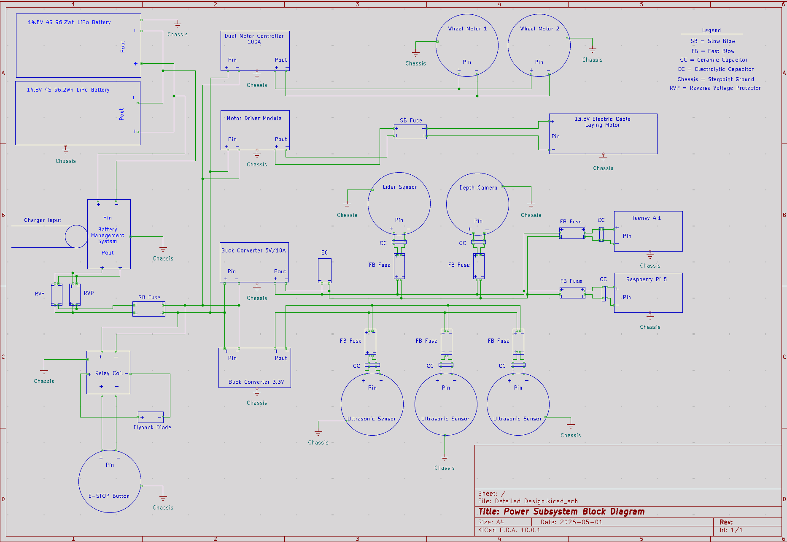
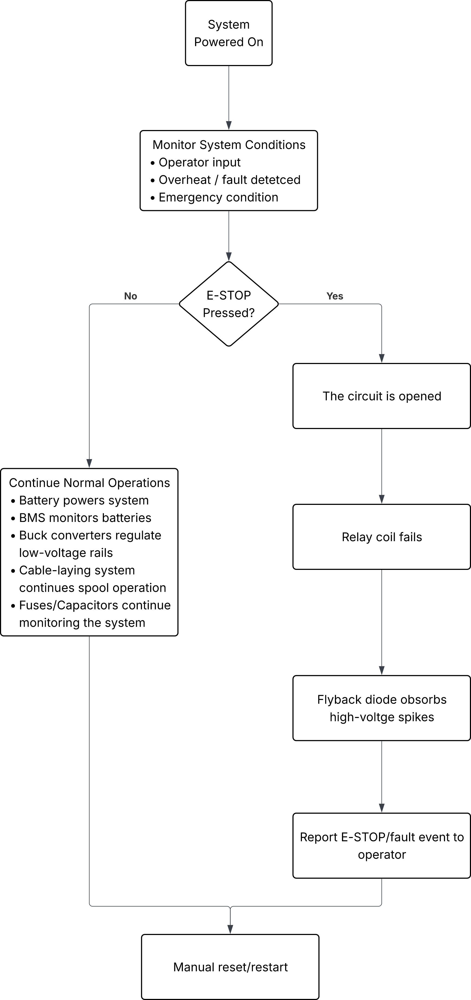

# Detailed Design: Power Subsystem

## Function of the Power Subsystem

The power system serves as the skeleton of the overall design of CirceBot. Its function is the centralized source of energy distribution to all components that require power to operate. Building on the system's conceptual design, the primary role of the subsystem is to provide stable power to each subsystem of CirceBot. This includes the drivetrain and motors, operating system, navigation system, hard-wire communication interface, and the cable laying spooling mechanism. Also, keep in mind that the system is modular.

The subsystem is designed with mindfulness of practicality, efficiency, and compactness, limiting the complexity of wiring and focusing on the reliability of the system overall. To ensure clear design implementation and easy maintenance, minimizing unnecessary interconnections and maximizing power distribution are central to achieving the power system's goal. Keeping in mind the limitation of space inside the platform body of the robot. Not just delivering power, the power system is responsible for regulating voltage across different components that will need different amounts of voltage to operate. For example, the Raspberry Pi requires a regulated 5V supply to operate continuously; however, other systems, such as the motor drive and wheels, can surge in voltage when moving from a resting position.

The power system functions as a smart protective layer for the other subsystems located inside CirceBot. Incorporating overcurrent protection, voltage regulation, reverse-polarity protection, brown-out prevention, short circuit protection, and back EMF. Some of which are already incorporated within CirceBot (the drivetrain and motors within the platform), and some that need to be implemented, like the cable laying device and the sensitive electronics to prevent damage. This subsystem is an active essential system of the robot's architecture, producing robust, safe, and reliable operation across a variety of challenging operating conditions.

## Specifications and Constraints for the Power Subsystem

### Specifications:

- CirceBot shall have a dedicated, independent, rechargeable DC power source capable of delivering at least 20 minutes of runtime for the robot.
- CirceBot shall relay the battery state of charge (SOC), state of health (SOH), and temperature data to the user interface.
- CirceBot shall have a dedicated E-STOP button integrated into the power system that will allow the user to quickly and easily disconnect power from the robot.
- CirceBot shall be made modular to allow for easy installation and removal of the added power connections to the platform robot, as well as isolated system test runs.
- CirceBot shall have all necessary safety features and components to allow the robot to operate safely without the risk of faults or failure.

### Constraints:

- There is limited space for housing within the CirceBot platform chassis, affecting battery placement and intricate wire management. Proper management is crucial for safety, requiring careful routing to prevent overheating, insulation damage, and increased fire risk [1].
- With limited space, drilling exit holes into the chassis of CirceBot is not recommended, as CirceBot needs to be modular so it can be reverted into the pre-bought platform robot that can be used for other future projects.
- CirceBot's weight cannot exceed the capacity of the torque generated from the wheel motors of the platform robot.

## Overview of Proposed Solution/Interface with Other Subsystems

The proposed solution of the power subsystem is based on the integrated power system of the pre-bought platform robot. The platform robot is powered directly from a single, centralized battery installed inside its chassis to power the entire system. The platform robot includes a dual motor controller, two brushless motors, one 14V lithium-ion battery, and an anti-spark switch (handles inrush current at start up to prevent arcing).

The battery that comes with the platform robot does not cover the specifications of CirceBot's runtime, reaching at least 20 minutes. So, the primary battery for the CirceBot power system will be two 14.8V, 4-cell, 96.2Wh lithium-ion polymer (LiPo) batteries connected in parallel. The calculations for the selected battery pack solution are shown below.

## Power Consumption

The design of the power subsystem is to have it implemented as a de-rated system. Designing a de-rated system increases reliability, extends component lifespan, and reduces thermal stress. This method is incorporated as a safety buffer, compensating for potential unforeseen operating conditions. Having this safety buffer is crucial for implementing a power system that could potentially change in later stages of development and testing. Including adding onto the CirceBot system, which could potentially consume even more power from the source. Designing a de-rated system includes calculating each component (that draws power or current) at its maximum rating, then adding a small percentage for sizing conductors and estimating heat, particularly for loads operating over a continuous time [2].

There are three voltage rails added onto the platform robot to distribute power to all specific subsystems and components that will be integrated into CirceBot. The first is a 5V rail, which is responsible for powering most of the sensitive electronics that will be added onto CirceBot. The second is a 3.3V rail specifically to power the three ultrasonic sensors that will be mounted onto CirceBot. The third is a direct feed to the cable laying system from the BMS. This rail contains an electric DC motor and a motor driver module with it. There will be a buck converter attached to each voltage rail except for the cable laying rail; each buck converter contains power loss as well.

Connections must be made between the different electronics and motors across the different voltage rails as well. These wires will, on average, have a 2ft round trip throughout CirceBot. Based on the American Wire Gauge (AWG), the cross-sectional area of each gauge is an important factor for determining its current-carrying capacity [3]. The choice of the size for each wire was calculated based on keeping the voltage drop as minimal as possible, especially for the sensitive electronics, but at the same time, checking ampacity to prevent insulation melting and fire hazards. The 5V rail will use AWG 18, the 3.3V rail will use AWG 26, and the cable-laying rail will use AWG 14. Also, not accounting for power loss through wires already installed in the platform section of CirceBot.

### Platform robot:

The 2 Justock-3650-G2.1-21.5T brushless motors draw 3A of current with no load current and output a maximum of 115W [4]. Assuming 85% efficiency, typical for small, well-loaded motors, based on the assumption that the motors will draw more current with the added weight to the robot, the input power to the motor would be 135W.

$$\textbf{(1)} \quad \frac{P_{out}}{P_{in}} \times 100 = \eta = 135\text{W}$$

Assuming the max amount of input voltage is 11.1V, based on the datasheet, the maximum amount of current being pulled by each motor would be around 12A.

$$\textbf{(2)} \quad I = \frac{135\text{W}}{11\text{V}} \approx 12\text{A}$$

Inferencing a normal load current of between 6 and 10A, 10A for max current, the output power of each motor would be 110W. This conclusion, of the load current, was made based on the specifications from DEVCOM stating CirceBot would be tested on flat ground with the robot being weighted more heavily. Based on this, the total power consumption from the motors is predicted to be 220W.

The Dual FSESC4.20 100A does not draw a significant power loss to the system; the motor controller is well rated above the maximum current flowing through the system during multiple current spikes, as well as the spikes coming from the motors during startup or stalling [5].

The Anti Spark Switch's power consumption is negligible, as its purpose is to "sense" when the power button is turned on or off. It operates as a simple, high-efficiency MOSFET switch.

### 5V Rail:

The Raspberry Pi 5's peak current draw is 5A, but that is at its maximum operating level; that amount of stress on the Pi is not within the scope of the project, so the projected max current the Pi will put out is around 3A. From Ohm's law, based on equation (2), the max power consumption through the Pi 5 is 15W [6].

The D456 Camera's peak current draw is 700mA, so for safety measures, estimate the max current draw is 800mA. The max power consumption is 4W [7].

The RP LIDAR A1M8 Sensor's peak current is 500mA, accounting for both the scanning and motor system together. However, that motor can surge in current during start-up, so the max current pull is increased to 600mA. The max power consumption is 3W [8].

The Teensy 4.1's peak current is 0.1A, which can easily be neglected, but just to stay uniform, the max current pull from it can be up to 0.2A. The max power consumption is 1W [9].

The 5V/10A non-isolated Buck Converter has a conversion efficiency greater than 94%, for a de-rated system, calculate for the 94%. Buck converters don't convert power from a higher to a lower level perfectly; there is some energy loss in the process, and that energy loss is dependent on the make and model of the buck converter [10]. Calculate the difference between the input power and output power to find the loss, equation (1). The max power loss is 3.2W.

The AWG 18 wire was calculated from measuring the resistance in Ohms/ft multiplied by the length of the wire in equation (3).

$$\textbf{(3)} \quad R = \left(\frac{\Omega}{ft}\right) \times L$$

The resistance calculated for the 18-wire is 12.77mΩ, based on the wire chart. Then multiply it by the combined current running through the rail (multiplied by 125%, safety margin [2]) to calculate a voltage loss of 0.07V. Voltage drop is calculated by equation (4) below.

$$\textbf{(4)} \quad V_{drop} = \frac{V_{loss}}{V_{rail}} \times 100 = 1.4\%$$

The power loss is then calculated as 0.36W, which is very small and can be negligible.

### 3.3V Rail:

The A02YYUW Waterproof Ultrasonic Sensor's peak current is less than 8mA, max current pull is 8mA. The max power consumption is 0.03W for all three [11].

The 3.3V/2A Continuous non-isolated Buck Converter's power loss is negligible based on the low voltage and even lower current passing through the rail. It will produce a very small power loss to the system, not worth documenting [12].

The power loss through AWG 26 is even smaller compared to the power loss through the 18-wire, resulting in it being negligible.

### Cable laying Rail:

The Electric DC Motor's peak current draw during startup is 6A. For the de-rated system, the max current draw will be scaled up to 7A, with its input voltage rated at 13.5V; the max power consumption is 94.5W [13].

The Motor Driver Module handles current spikes from the motor that is dispensing the wire. Based on the datasheet, there is a path resistance between the MOSFETs in the H-bridge, one high side and the other low side, which averages around 16mΩ [14]. If the current spikes to 15A from the cable-laying motor, the power loss would be 3.6W. If there was poor temperature regulation, the loss could jump up to 5W. However, this is an efficient motor driver (97.6%), and the threat of added power loss through heat is minimal.

The AWG 14 has a cross-sectional area of 2.525mΩ, based on equations (3) and (4), and using the total max current running through the rail (15A), the power loss is 1.13W.

## Table 1: Total Power Summary

| Voltage Rails         | Power    |
|-----------------------|----------|
| Drive System          | 220W     |
| 5V Electronics        | 23W      |
| 3.3V Electronics      | 0.03W    |
| Cable Laying System   | 94.5W    |
| Conversion + Wiring Loss | 8–10W |
| **Total Subsystem Power** | **~350W** |

From the table above, the total subsystem power is roughly 350W. CirceBot must run for at least 20 minutes. Based on the equation below, the watt-hours needed to run CirceBot for the specified time are ~117 Wh.

$$\textbf{(5)} \quad Wh = P_{total} \times \frac{20}{60}$$

Referring previously to the two batteries that will be used for the power subsystem, each battery is 14.8V, 6500mAh, and 96.2Wh. So, two batteries in parallel supply the power system with 192.4Wh, which is more than enough for CirceBot to achieve at least 20 minutes of runtime.

## Buildable Schematic

The KiCad diagram below is a block diagram laying out the power subsystem of CirceBot. The Block Diagram shows the four voltage rails implemented into CirceBot, the two battery packs used to power the system, a BMS, and an emergency stop button. The green lines are the DC wire distributed to each component, supplying power throughout the system of CirceBot. The diagram also shows the safety components implemented throughout the power system, as well, with a legend explaining each one of them. The entire power subsystem is Starpoint grounded to the chassis of the robot, where each component has a ground node attached to it.

## Flowchart

The flowchart below explains what happens to the power system and the CirceBot when the E-STOP button is pressed. When the emergency condition is set, based on feedback from the system or for test purposes, the emergency stop button is pressed. When this occurs, the circuit is opened, and the entire power subsystem loses power completely. Then, the data is sent to the user interface to explain that the E-STOP button has been pressed and requires manual reset/restart.

## Bill of Materials (BOM)

| Component | Part # | Vendor | Qty | Unit $ | Subtotal $ | URL |
|---|---|---|---|---|---|---|
| LiPo Battery 14.8V | 4S 6500mAh | Ovonic | 2 | 74.56 | 149.12 | [Link](https://us.ovonicshop.com/products/ovonic-80c-14-8v-6500mah-4s-lipo-battery-xt90) |
| 5V/10 A Buck Converter | — | Geekworm | 1 | 12.90 | 12.90 | [Link](https://geekworm.com/products/dc-dc_step-down_converter) |
| 3.3V Buck Converter | — | Amazon | 1 | 7.99 | 7.99 | [Link](https://www.amazon.com/NOYITO-Waterproof-Overcurrent-Short-Circuit-Undervoltage/dp/B07HCTNHL7) |
| Gear Motor | PN01007 | MakerMotor | 1 | 75.00 | 75.00 | [Link](https://makermotor.com/pn01007-10mm-2-flat-shaft-electric-gear-motor-12v-low-speed-50-rpm-gearmotor-dc/) |
| Wheel Encoder | SEN-12629 | SparkFun | 1 | 13.95 | 13.95 | [Link](https://www.sparkfun.com/wheel-encoder-kit.html) |
| Motor Driver | BTS7960 | Amazon | 1 | 15.99 | 15.99 | [Link](https://www.amazon.com/HiLetgo-BTS7960-Driver-Arduino-Current/dp/B00WSN98DC) |
| Power Connectors | 30A Set | Amazon | 1 | 13.99 | 13.99 | [Link](https://www.amazon.com/smseace-Connectors-Disconnect-connectors-Retardant/dp/B0CT4ZQ9FX) |
| E-Stop Button | — | Amazon | 1 | 16.99 | 16.99 | [Link](https://www.amazon.com/Emergency-Latching-Aluminum-Waterproof-Self-Locking/dp/B0BZRN4Z83) |
| Relay (12V) | PC792A | DigiKey | 1 | 2.39 | 2.39 | [Link](https://www.digikey.com/en/products/detail/picker-components/PC792A-1C-C1-12C-N-X/12352857) |
| 14 AWG Wire | — | Ace Hardware | 1 | 9.99 | 9.99 | [Link](https://www.acehardware.com/p/3009572) |
| 18 AWG Wire | — | Parts Express | 1 | 6.98 | 6.98 | [Link](https://www.parts-express.com/Consolidated-Stranded-18-AWG-Hook-Up-Wire-25-ft.-Blue-UL-Rat-101-726?quantity=1) |
| 26 AWG Wire | — | Parts Express | 1 | 3.79 | 3.79 | [Link](https://www.parts-express.com/Consolidated-Stranded-26-AWG-Hook-Up-Wire-25-ft.-Red-UL-Rate-101-702?quantity=1) |
| Diodes (1N4007) | — | DigiKey | 5 | 0.21 | 1.05 | [Link](https://www.digikey.com/en/products/detail/onsemi/1N4007G/1485479) |
| 4A Fuse | 0287004 | DigiKey | 5 | 0.44 | 2.20 | [Link](https://www.digikey.com/en/products/detail/littelfuse-inc/0287004.PXCN/3102554) |
| 1A Fuse | 0287001 | DigiKey | 5 | 0.44 | 2.20 | [Link](https://www.digikey.com/en/products/detail/littelfuse-inc/0287001.PXCN/3102551) |
| 0.25A Fuse | 0235.250 | DigiKey | 5 | 1.35 | 6.75 | [Link](https://www.digikey.com/en/products/detail/littelfuse-inc/0235.250HXP/778114) |
| Electrolytic Caps | — | DigiKey | 5 | 0.90 | 4.50 | [Link](https://www.digikey.com/en/products/detail/rubycon/35PK1000M10X20/5430090) |
| Ceramic Caps | — | DigiKey | 10 | 0.28 | 2.80 | [Link](https://www.digikey.com/en/products/detail/kemet/C318C104Z5U5TA/12700016) |
| Rev Voltage Protect | 5389 | Pololu | 2 | 8.49 | 16.98 | [Link](https://www.pololu.com/product/5389) |

**Total Cost: $365.56**

## Design Analysis

The calculation of the total power consumption and loss through the power system of CirceBot resulted in the decision of the two battery packs stated previously. Two battery packs in parallel were chosen rather than one big battery pack because the two batteries can split the current, reducing the load (amperage) on each battery. Two batteries sharing a load decreases stress, reduces heat generation, and improves efficiency. Some safety precautions are that both batteries should have the same voltage to prevent damage, and both batteries must be the same make, capacity, and age to prevent one battery from overstressing the other. Also, lithium-ion batteries tend to unevenly dissipate cell voltage. Cell imbalance is a result of different process variations, temperature, and aging that cause some cells to discharge faster or retain less charge than others [15]. To prevent this imbalance, a BMS is connected between the charging input and battery to actively track the health of each cell. The Battery Management System (BMS) ensures the safety, efficiency, and longevity of the battery packs by monitoring, protecting, and balancing cells [16]. The BMS balances the charge across all cells, preventing the weaker cells from hindering the pack's performance. Also, it constantly monitors cell voltage, current, and temperature to quickly shut the power system down if the cells' health moves outside of normal operating conditions. The ideal BMS has not been determined yet for its specifications for the power system; this can be solved between semesters or during the start of the next semester.

The BMS branches out to four different voltage rails efficiently distributing power, a 5V rail, a 3.3V rail, a cable-laying system, and the rail leading into the platform robot. From the BMS, there are 2 reverse voltage protectors connected in parallel to protect the electrical components throughout the system from incorrect power polarity. There will be many connections made between the different systems throughout CirceBot, which also increases the chance of incorrect wire installment. If this were to happen during later stages, these two components will block current flow or shunt power away, shutting down the device or continuing normal operation while avoiding permanent failure or overheating [17]. The reasoning for two in parallel is due to the limitation of finding one with a higher rated current protection. To utilize two, they must run wires that are the same in length and must be physically close to each other to reduce resistance mismatch and improve current sharing between the two. An uneven load or unequal wires could cause one module to do all the work, creating a risk of failure. After the voltage protectors, there will be one fuse before the intersection of each voltage rail. This fuse will be the main fuse that protects the entire system. This fuse is used as a last resort safety for the system against the unlikely event that the BMS internal electronics malfunction. The specific type of fuse must be a slow-blow fuse. Slow-blow fuses are used for current spikes generated by motors during start-up. Current spikes are only momentary, so slow-blow fuses feature a delayed response. They allow for brief surges but blow if the overcurrent lasts for a sustained period, protecting against damage [18]. Each fuse must be rated at least 125% of the current passing through it [2]. This fuse hasn't been specified yet due to the issue of not finding the proper BMS; this will be addressed in later stages. There will be two non-isolated buck converters utilized for the 5V and 3.3V rails, as these converters will be responsible for stepping down the voltage to the correct level to safely power the components located on each rail.

The 5V rail is responsible for powering most of the electronics, transmitting data for CirceBot. One caution of this design, for example, is that the Raspberry Pi 5 is very sensitive to voltage sag, as it is a side effect of actuator systems (motor systems) during the initial start-up of the motors. These spikes can cause electronics to malfunction and potentially damage sensitive components. The Pi 5 cannot experience a voltage sag of 5% or the electronic will reset, as the brownout triggers a fault, causing the Pi to fail. By adding a bulk capacitor (electrolytic) right after the voltage rail, the slow, big energy changes will be absorbed by the capacitor, mitigating the effects of brownout. The value of the capacitor was calculated by using the equation of current with respect to the capacitor over time.

$$\textbf{(6)} \quad I = C\frac{dv}{dt}$$

Since the Pi could experience about 1A extra from brownout, the process of brownout for the longest time could be around 1ms, and 5% of sage on the 5V rail, the value of the capacitor is calculated at 4000μF based on equation 6. The buck converter already handles some of the brownout caused by the motors, so the value of the capacitor can be scaled down 25%. The electrolytic capacitor's value is 1000μF, and this rating is correct for limiting voltage sag to less than 5% for the electronics. However, smaller voltage oscillations (voltage ripples) bypass this capacitor due to the faster, smaller spikes. These ripples are caused by the switching of the buck converters, rapidly turning the current on/off as the current passes through the capacitor's Equivalent Series Resistance (ESR) [19]. The use of a Ceramic capacitor nullifies the voltage ripples caused by the converter. The capacitor is based on frequency response and impedance.

$$\textbf{(7)} \quad z = \frac{1}{2\pi f C}$$

Since the minimum frequency transmitted to the Pi from the Ethernet cable is 1 MHz, the estimated value of the capacitor is around 0.1μF. Using equation 7, the calculated capacitor impedance is 1.6Ω, which is low enough to absorb fast spikes and high-frequency noise. This capacitor will be added to every sensitive electronic component implemented into CirceBot. Also, there must be an inline fuse on the power line leading to each electronic device; more specifically, these fuses must be fast blow fuses. Fast blow fuses immediately interrupt high-current, short-circuit faults to protect sensitive electrical components, preventing overheating [18]. The method is used for redundancy and testing reasons, to easily identify and locate a fault within the system, and to keep the power system uniform.

The 3.3V rail is responsible for powering the three ultrasonic sensors that will be mounted onto CirceBot. The reason for having a dedicated voltage rail to power the ultrasonic sensors is due to them communicating data and information through UART (Universal Asynchronous Receiver-Transmitter). UART's output voltage precisely mirrors the input UART signal voltage. However, the Teensy has output pins designed into the board to be able to supply a constant 3.3V to the sensor, but at the same time, it increases the load on the Teensy's processing power. The Teensy is needed to communicate with the Pi, the other sensitive electronics, and the motors implemented into the CirceBot system. By avoiding further stress on the Teensy microcontroller, installing a separate voltage rail for the sensors is the best design solution.

The cable-laying rail is responsible for supplying voltage to the motor that is going to actively lay cable as the CirceBot moves to the desired location. The design for the motor laying the cable is a general replacement of the cable-laying system that the ME team is going to design. The reason for this design is to be used as a backup plan if the ME team's spool/cable laying system fails. The reasoning of the motor calculated is from creating the dimension of the spool itself and the cable that will be wrapped and deployed from this spool. The dimensions of the CAT5e Ethernet cable are 5.5mm (d), the length of the cable will be 100m (L), then the wire volume is found to be 2.376m³.

$$\textbf{(8)} \quad V_{wire} = L \times \pi \times \left(\frac{d}{2}\right)^2$$

The equation above calculates the physical volume the wire occupies. However, wires do not pack perfectly, but when wrapped around a spool, the packing factor is higher. Based on this, and working with CAT5e, the packing factor would typically be 0.8 [20].

$$\textbf{(9)} \quad V_{required} = \frac{V_{wire}}{0.8} \approx 2.97\text{mm}^3$$

To design the spool mechanism to calculate the amount of force needed to deploy the wire, the inner core diameter, spool width, and outer flange diameter must be determined. A standard 100mm core is recommended to prevent stress on the internal copper pairs to ensure that the physical geometry of the cable (twist rate) remains intact [21]. Avoiding potential failure to meet CAT5e performance standards. A width of 150mm (W) is a common standard for 100mm portable cable reels, providing stability during winding and unwinding. This specific width ensures the cable wraps securely without overlapping or slipping off the sides [21]. Using the volume of a hollow cylinder (the space between the core and the outer edge), the outer diameter can be found.

$$\textbf{(10)} \quad V_{spool} = W \times \pi \left(({\frac{D_{outer}}{2})^2} - ({\frac{D_{inner}}{2})^2}\right)$$

Based on equation 10, the outer diameter would be around 190mm. The material of the spool can be 3D printed to support the weight of the cable (6.6–8.8lbs). The standard installation tension for CAT5e is 10–30N. For safe design purposes, assume 30N, considering drag, bends, and minor snags. To find the required torque, the spool geometry must be converted to radius (r_inner = 0.05m, r_outer = 0.095m). The torque requirement is worst at the largest radius.

$$\textbf{(11)} \quad T = F \times r_{outer}$$

The torque required is 2.85 Nm, double the force for a high margin of safety, to where the torque needed is 5.7Nm.

A wheel encoder will be attached near the actuator of the motor to measure actual cable movement, not spool rotation. The wheel encoder will generate simple digital pulses that will be transmitted to the Teensy to determine position and speed. A motor driver will be installed leading into the cable-laying motor, providing necessary current amplification to manage speed, direction, and braking [22]. This will be used instead of a buck converter because DC motors require current for effective speed and load control, rather than voltage regulation. Also, for safety reasons, this motor will have a slow-blow fuse protecting the rail.

An emergency stop button must be designed into the power system in case CirceBot starts operating outside of its normal operations to shut down the system entirely. The button will be added to the main voltage bus after the BMS. The highest current risk is the cable-laying motor (15A); the E-STOP button should have a higher current rating because DC voltage is harder to interrupt compared to AC voltage. DC voltage maintains a constant, high-energy current; when a switch opens to break a DC circuit, the arc that forms can be sustained, intense, and difficult to break. A relay coil can be used to help make sure the circuit is broken. Ensuring that if the relay itself fails, the machine shuts down [23]. However, the risk of the E-STOP button getting damaged is still relevant, as well as the electronics from the abrupt interruption. A flyback diode will be connected across the relay coil to eliminate sudden, high-voltage spikes that occur when the power is turned off [24].

The power system will be entirely modular, so when the objective of CirceBot is accomplished, all the added material and components can be removed, and it will return to the platform robot it was before. The installation of power pole connectors will allow the system to be modular, located at the beginning of each voltage rail, allowing for easy disconnection and testing. Also, implementing the new batteries does not negatively impact the motor controller and motors that were already installed in the platform section of CirceBot. The voltage increase is only 0.8V, not large enough to cause any system problems, but it does slightly improve motor performance. Overall, the integration of high-capacity power delivery, voltage regulation, and protective measures demonstrates that the design not only meets the operational requirements of the robot but also ensures long-term stability and system reliability.

## References

[1] Balaji Switchgears, "Why proper cable management matters for long-term safety," [Online]. Available: https://balajiswitchgears.com/why-proper-cable-management-matters-for-long-term-safety/

[2] Electrical License Renewal, "NEC Content – Electrical Continuing Education Courses," [Online]. Available: https://www.electricallicenserenewal.com/Electrical-Continuing-Education-Courses/NEC-Content.php?sectionID=32

[3] Wikipedia, "American wire gauge," [Online]. Available: https://en.wikipedia.org/wiki/American_wire_gauge

[4] Hobbywing, "Electronic Speed Controller Manual," [Online]. Available: https://www.hobbywing.com/en/uploads/file/20221013/a395bfd32f9e35e94f46fb2ac7ac10cd.pdf

[5] "Dual FSESC4.20 100A Manual," Scribd, [Online]. Available: https://www.scribd.com/document/772852801/Dual-FSESC4-20-100A-MANUAL-20181106-pdf

[6] Richard Electronics, "Raspberry Pi 5 pinout, specs, datasheet," [Online]. Available: https://www.richardelectronics.com/blog/projects/raspberry%20pi/raspberry-pi-5-pinout-specs-datasheet-projects

[7] Intel, "RealSense D456 Datasheet," [Online]. Available: https://static.generation-robots.com/media/Intel-RealSense-D456-Datasheet-en.pdf

[8] Slamtec, "RPLIDAR A1M8 Datasheet," [Online]. Available: https://www.generationrobots.com/media/rplidar-a1m8-360-degree-laser-scanner-development-kit-datasheet-1.pdf

[9] PJRC, "Teensy 4.1 Development Board," [Online]. Available: https://www.pjrc.com/store/teensy41.html

[10] Geekworm, "DC-DC Step Down Converter," [Online]. Available: https://geekworm.com/products/dc-dc_step-down_converter

[11] DFRobot, "DC-DC Buck Converter Module," [Online]. Available: https://www.dfrobot.com/product-1935.html

[12] Amazon, "NOYITO Waterproof Buck Converter," [Online]. Available: https://www.amazon.com/NOYITO-Waterproof-Overcurrent-Short-Circuit-Undervoltage/dp/B07HCTNHL7

[13] MakerMotor, "12V Low-Speed Gear Motor PN01007," [Online]. Available: https://makermotor.com/pn01007-10mm-2-flat-shaft-electric-gear-motor-12v-low-speed-50-rpm-gearmotor-dc/

[14] Wikipedia, "American wire gauge," [Online]. Available: https://en.wikipedia.org/wiki/American_wire_gauge

[15] Large Battery, "Lithium battery cells imbalancing prevention," [Online]. Available: https://www.large-battery.com/blog/lithium-battery-cells-imbalancing-prevention/

[16] Flux Power, "Battery Management System: The brain of lithium-ion battery pack," [Online]. Available: https://www.fluxpower.com/blog/battery-management-system-the-brain-of-the-lithium-ion-battery-pack

[17] Monolithic Power Systems, "Reverse polarity protection circuits," [Online]. Available: https://www.monolithicpower.com/learning/resources/designing-a-reverse-polarity-protection-circuit-part-i

[18] Ariat-Tech, "Understanding slow-blow vs fast-blow fuses," [Online]. Available: https://www.ariat-tech.com/blog/understanding-slow-blow-vs.fast-blow-fuses.html

[19] Texas Instruments, "Output ripple in switching regulators," [Online]. Available: https://www.ti.com/lit/an/slvaed3a/slvaed3a.pdf

[20] Standard Wire, "Cable design formulas," [Online]. Available: https://standard-wire.com/resource/cable-design-formulas/

[21] RepRap, "Filament spool," [Online]. Available: https://reprap.org/wiki/Filament_spool

[22] Monolithic Power Systems, "Introduction to motors and motor drivers," [Online]. Available: https://www.monolithicpower.com/learning/resources/an-introduction-to-stepper-motors-dc-motors-and-motor-drivers

[23] Shenler, "DC power relay explained," [Online]. Available: https://www.shenler.com/an/new/dc-power-relay-explained-working-principle-types-and-uses/

[24] CircuitBread, "How does a flyback diode work," [Online]. Available: https://www.circuitbread.com/ee-faq/how-does-a-flyback-diode-work
