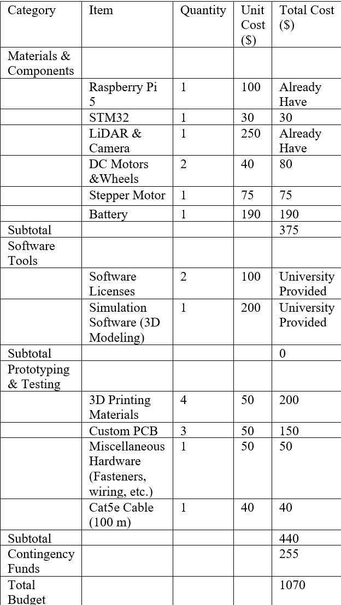

::: titlepage
**Cable Installation Robot for Contested\
Environments (CIRCE) Project Proposal**

**Team Members:**

Gerardo Ramirez

Daniel Davis

Brady Harkleroad

Summer Morris

Nick Romsdal

Sharif Zahra

ECE 4961 --- Capstone Design 1

Tennessee Tech University

February 23rd, 2026
:::

::: IEEEkeywords
Sensor Fusion, SLAM, GPS Denied Autonomous Systems
:::

# Introduction

Modern military operations rely heavily on network-centric warfare, but
this dependency creates a vulnerability: adversaries can jam up radio
frequencies to deny wireless communications in contested environments.
When wireless systems fail, hardwired ethernet cables offer a reliable
alternative that cannot be jammed remotely. The problem is that
deploying these cables currently requires soldiers to physically lay
them through hostile environments, putting personnel directly in harm's
way. The Cable Installation Robot for Contested Environments (CIRCE)
eliminates this risk by autonomously deploying communication cables in
dangerous zones, allowing units to establish secure connections without
exposing anyone to enemy fire.

This proposal outlines the design and development of CIRCE to meet
requirements specified by the U.S. Army Combat Capabilities Development
Command (DEVCOM). The robot must navigate autonomously through contested
terrain, even when GPS is jammed, all while deploying ethernet cable
that meets TIA/EIA-568 installation standards. It shall communicate back
to C2 through the cable it lays and run for at least 20 minutes on the
power supply. Making this work requires bringing together several
complex systems: autonomous navigation that doesn't rely on GPS, sensors
that detect obstacles in real time, and efficient power management to
keep everything running in the field.

# Formulating the Problem 

The establishment of reliable communication networks is a cornerstone of
modern military operations. In conventional scenarios, wireless radio
frequency (RF) communications provide flexibility and speed for
effective coordination. However, adversaries are actively developing
capabilities to intercept and jam these signals, creating a \"silent
battlefield\" where command and control (C2) capabilities are degraded,
and units lose the ability to coordinate operations, share intelligence,
or maintain situational awareness [@army_armor_space]. To combat this
degradation in frequency-contested environments, hardwired ethernet
cable becomes the necessary alternative to establish jam-resistant
communication that cannot be interfered with by adversaries. However,
establishing these hardwired connections currently requires personnel to
manually lay communication lines through contested zones, exposing
military personnel to enemy fire, improvised explosive devices (IEDs),
and unnecessary combat danger. Based on the needs of the U.S. Army
Combat Capabilities Development Command (DEVCOM), the Cable Installation
Robot for Contested Environments (CIRCE) system addresses this critical
capability gap by autonomously deploying communication cables in hostile
environments, eliminating personnel risk while restoring reliable C2
communications.

The U.S. Army requires unmanned systems capable of entering high-risk
zones to remove personnel exposure during communication infrastructure
deployment. The CIRCE system must operate independently to keep military
personnel out of danger while traversing contested areas and deploying
hardwired communication cables. The system must navigate to designated
waypoints in GPS-denied environments where satellite navigation is
unavailable due to jamming or physical obstructions. Because the robot
operates in high-risk zones where human intervention is dangerous, it
will encounter physical challenges including rough terrain, uneven
hills, and obstacles that require robust mobility systems to maintain
traction and reach designated locations. The soil's ability to provide
traction is limited for small, unmanned ground vehicles (UGVs), and
wheel slip can minimize mobility, causing the robot to become
immobilized in certain terrain conditions.

The CIRCE system must deploy physical communication lines while
traversing complex environments where cables are susceptible to catching
on natural or man-made objects. The system requires a spool mechanism
capable of deploying communication lines at controlled speeds
synchronized with the robot's forward velocity and slack conditions to
minimize cable entanglement. If cable deploys too rapidly, it creates
excessive tension and slack that the robot must overcome by increasing
acceleration, resulting in higher battery consumption and potential
cable damage. Conversely, insufficient deployment speed causes the robot
to drag cable, increasing pulling tension beyond acceptable limits, and
risking cable jacket damage or conductor breaks. The cable management
system must maintain proper tension---typically 25 pounds maximum for
Cat5e/Cat6 ethernet---while adhering to minimum bend radius
specifications of 4-8 times cable diameter to ensure signal integrity
[@belden_cat6].

While other robotic solutions exist, they lack critical factors
necessary to complete this mission. Unmanned aerial vehicles (UAVs) and
drones commonly deployed in similar situations face fundamental payload
limitations when carrying the substantial weight of communication cables
designed to withstand rough environmental conditions. The physical
weight of cables restricts how far and how long UAVs can travel before
battery depletion forces mission termination [@dronelife2025tethered].
Additionally, when UAVs begin unwinding cable during flight, the
aerodynamic forces and shifting center of gravity caused by the trailing
cable can destabilize the aircraft, making it difficult to control and
potentially causing crashes [@army_fiber_drones]. Ground-based
commercial robots, while offering superior payload capacity, are not
purpose-built for cable deployment and lack integrated cable management
subsystems, requiring extensive modification that essentially duplicates
the engineering effort CIRCE demands.

Both UGVs and UAVs offer distinct advantages and disadvantages in their
operational approaches, but the critical requirement is designing and
implementing a robust robotic system capable of overcoming the unique
challenges of autonomous cable deployment in contested environments. The
challenge necessitates a dedicated engineering team to achieve complex
integration of an autonomous ground-based navigation system operating in
GPS-denied conditions with the dynamic physical demands of deploying a
communication tether while maintaining cable installation standards, all
within the constraints of limited onboard power and hostile operational
conditions. This multi-disciplinary integration requirement---spanning
electrical engineering, mechanical engineering, computer science, and
systems engineering---justifies the capstone project scope and
demonstrates the technical complexity that existing commercial solutions
cannot adequately address.

# Background 

Several technical and operational factors were considered in the
development of CirceBot. A closely related system is the cable
deployment system for unmanned ground vehicles (UGVs) developed by
Michigan Technological University [@naglak2021cable]. In their system, a
UGV departs from a fixed power source and traverses terrain while
deploying an electrical cable to establish connections between nodes
within an autonomous mobile microgrid. The platform integrates
navigation and environmental awareness technologies, including inertial
measurement units (IMUs), global positioning systems (GPS), Light
Detection and Ranging (LiDAR), and vision-based sensing to survey the
environment and ensure accurate cable placement between grid nodes
[@naglak2021cable].

A key subsystem in this design is the Adjustable Cable Management
Mechanism (ACMM), which prevents cable twisting, snagging, shunting, or
entanglement during deployment [@naglak2021cable]. This mechanism
enables controlled payout and mitigates mechanical failure due to
environmental obstacles.

The integration of cable management hardware with autonomous navigation
demonstrates the feasibility of mobile infrastructure deployment using
ground robotics. CirceBot adopts similar foundational principles in
mapping, navigation, and cable deployment. However, CIRCE is intended to
operate in more unpredictable environments [@naglak2021cable]. While the
system described in [@naglak2021cable] supports microgrid
infrastructure, CirceBot is designed for deployment in GPS-denied and
RF-jammed environments, where traditional wireless communication may be
unreliable or unavailable. In such environments, establishing a physical
communication backbone becomes critical.

The primary objective of CirceBot is to autonomously route and deploy
Ethernet cable across irregular, hazardous terrain to establish a secure
communication link between forward units and a base location. To
accomplish this, CirceBot will integrate multi-sensor navigation,
including LiDAR, infrared sensors, depth cameras, and additional
environmental perception systems to continuously monitor terrain
conditions and adjust its trajectory accordingly [@brown2022terrain],
[@lee2023sensor]. These sensors will enable real-time obstacle
detection, hazard avoidance, and adaptive path planning in unpredictable
operational environments.

Unlike conventional autonomous systems that rely heavily on GPS,
CirceBot must operate effectively in GPS-denied conditions. Therefore,
sensor fusion techniques combining LiDAR, inertial measurements,
odometry, and vision-based localization will be implemented to provide
reliable positioning and mapping [@lee2023sensor]. The onboard
processing architecture will include an embedded computing platform
capable of handling perception, mapping, and path planning algorithms. A
single-board computer may be used for high-level data processing and
communication between subsystems, while a dedicated microcontroller will
manage low-level motor control and real-time sensor interfacing.

A critical design consideration is the onboard cable management system.
The deployment mechanism must regulate cable tension to prevent
tangling, excessive drag, or mechanical failure during traversal
[@patel2021cable]. The system must also support controlled retraction if
route adjustments are required. This functionality draws conceptual
inspiration from the ACMM described in [@naglak2021cable], while
adapting it to Ethernet deployment.

In contrast to many autonomous systems that rely primarily on wireless
communications and GPS navigation, CirceBot will utilize the physical
Ethernet cable it deploys as its primary data communication medium. This
architecture increases resistance to RF interference and electronic
jamming while enabling high-bandwidth and low-latency connectivity. The
successful implementation of CirceBot requires the integration of
robotics, embedded systems, mechanical design, sensor fusion, and
resilient communications engineering to develop a reliable autonomous
cable-deployment platform suitable for operation in unpredictable and
hostile environments.

# Specifications

CirceBot shall be designed to receive and execute commands while
transmitting telemetry data in the format supplied in the
CirceSoft2CirceBot.proto spec from CirceSoft. CirceSoft shall accept
planned paths in the specified format and follow those paths to its
objective.

CirceBot shall dispense cable according to installation guidelines,
including proper curve radiuses, strain relief, and tension tolerances.

CirceBot shall be equipped with an independent power source capable of
at least 20 minutes of operation in Tennessee environments.

CirceBot shall transmit real-time data, including current position,
current velocity, meters of cable left, heading, battery life
percentage, and error codes if any occur.

CirceBot shall receive Next Position waypoints and navigate to the next
waypoint.

CirceBot shall carry up to 100 meters (approximately 10 lbs) of Ethernet
cable and report error codes via self-diagnosis.

CirceBot shall be rechargeable, send and receive commands at a minimum
frequency of 10 Hz, and communicate with CirceSoft using the WebSocket
protocol.

CirceBot shall have a switch to simulate GPS-denied environments and
will communicate using the deployed Ethernet cable.

CirceBot shall stop once the specified destination is reached and allow
for easy reloading and quick replacement of Ethernet cable reels within
2 minutes, without the use of external tools.

CirceBot shall use minor obstacle avoidance to avoid collisions.

# Constraints

The material cost of CirceBot shall remain within the established
budget, and any remaining or unused funds shall be retained by or
returned to Tennessee Tech University.

The construction and operation of CirceBot shall comply, as applicable,
with OSHA, ANSI/RIA, and ISO robotics safety standards
[@controleng2024safety].

The manufacturing, testing, and eventual deployment of CirceBot shall
not adversely affect the general public on the Tennessee Tech University
campus or within the surrounding Cookeville, TN area.

The design and construction of CirceBot shall also adhere to any
additional standards or requirements provided by the client or the
university, if applicable.

# Survey of Existing Resources

In recent years, autonomous robots have been developed that can navigate
complex terrain using various sensors. One example of this is the GE
Autonomous Robot ATVer developed by General Electric's (GE) Research Lab
team. The robot can navigate unstructured environments, such as forests,
using GE's Humble AI technology. Humble AI uses algorithms to assess
risks when traversing uncertain areas [@kenyon2021ge]. Although this
robot is an excellent option for navigating rugged environments, the
robot would not meet the specifications and constraints set for this
project. Another example of autonomous robots that can traverse
difficult territories is the CLAWbot developed by the Adaptive Robotics
and Technology Lab. The CLAWbot uses wheels and claw-like components to
traverse both smooth land and potential barriers. While the CLAWbot can
easily travel across obstacles, the robot has a fixed axis which would
make navigation more difficult [@nichols2024clawbot].

Clearpath Robotics has designed a few autonomous robots of varying sizes
that are suitable for rugged environments. One example is the Warthog,
which can navigate tough environments such as soft soils, vegetation,
mud, steep grades, and small amounts of water. The robot can run
unmanned and can use sensors, such as LiDAR, for obstacle detection. The
Warthog includes easy accommodation of accessories including sensors,
lights, and robotic arms to suit a wide range of needs. The robot also
includes a Robot Operating System already installed for easy setup. This
robot can hold up to 600 pounds and can travel at 11 miles per hour. The
battery has a nominal runtime of 2.5 hours, which is sufficient for most
applications. Although the Warthog would be a great option for
navigation, its heavy price tag makes this option unfeasible. While the
other models developed by the company are less expensive, they are
designed for smaller applications and would not work effectively in
rugged territory [@clearpath_warthog].

UAVs are an excellent option for navigation in GPS denied environments.
UAVs such as drones have exceptional flexibility and maneuverability,
which makes navigating complex environments much easier. Drones collect
data on the environment and its position using sensors such as LiDAR,
cameras, and IMUs. The data collected is then processed using advanced
algorithms, including SLAM, to map the drone's position and the
environment. The drone can then use that data to make decisions based on
what the optimal path would be and update the path as more data is
collected and processed [@chang2023uav]. One example of a UAV that can
navigate GPS denied environments was made by Andrew Bernas. Bernas used
VSLAM on a NVIDIA Jetson Orin Nano to navigate areas without the use of
GPS. The drone uses visual-inertial sensing and onboard mapping to
accomplish this [@bernas2025gps]. While drones are accurate,
independent, faster, cheaper, and less likely to take damage, the drones
have many disadvantages that ultimately would not fit the constraints
and specifications for this project. Drones need complex algorithms,
sensor limitations, powerful computing systems, government regulatory
barriers, issues with integration, and would not be able to hold heavy
equipment. These issues and disadvantages ultimately make drones unideal
for this project [@chang2023uav].

Reviewing other environments autonomous systems can operate in,
autonomous underwater vehicles (AUVs) pose transferrable aspects despite
maneuvering via unique propulsion system compared to terrestrial
systems. One such robot has been deployed by Japanese researchers to
aide in deploying fiber optic cable. Despite the remote operated vehicle
(ROV) having sub systems pertaining to buoyancy control, one such sub
system most applicable to the terrestrial environment is the cable
installation sub system. The AUV cable sub system utilizes a sheave and
bobbin system, each independently driven by motors, to guide the cable
while reducing the risk of cable entanglement during deployment. This
combination may open avenues for further research for cable feeding
feedback when measuring cable tautness and varying cable dispensing
speed [@choi2015cable].

# Measures of Success

Measures of success of the CIRCE system will be based on whether
CirceBot has the capability to communicate with CirceSoft, complete its
intended mission without external intervention, and lay cable
efficiently as outlined in the specification sheet. The CirceBot shall
successfully navigate to specified waypoints provided by CirceSoft while
operating in both normal and GPS-denied modes. Success will be measured
by the robot reaching all waypoints within the expected path tolerance
and without requiring manual correction. The CirceBot shall deploy up to
100 meters of Ethernet cable while maintaining proper installation
practices, including acceptable bend radius, strain relief, and tension
control. The installed cable will be inspected after deployment to
verify that it meets the guidelines and remains fully functional. The
system shall operate for a minimum of 20 minutes on its independent
power source while carrying the required an approximated 10 lbs. of
cable load. Success will be measured by continuous operation without
power failure during the test period. The system shall transmit and
receive commands at a minimum rate of 10 Hz using the deployed Ethernet
cable and WebSocket protocol. Success will be measured by verifying
consistent telemetry updates and command acknowledgment throughout
operation. The CirceBot shall operate without physical assistance during
mission execution, including obstacle avoidance, path following, cable
deployment, and stopping at the final destination. Overall success will
be determined by the system's ability to restore a communication link
between the simulated C2 location and the asset while meeting the
defined specifications.

# Resources

Each team member must utilize a diverse range of engineering skills to
properly and successfully design, build, and implement each segment of
this project. The team must also stay within the boundaries set before
them, either by the buyer, supervisor, etc. Each team member must
contribute to the tasks set before them, utilizing their unique
expertise in the concentration, ensuring each aspect of the project is
addressed effectively.

A wide range of sources are required to ensure successful completion of
this project. Each team member holds valuable skills that are necessary
in the design and implementation of the robot. Such skills include 3D
design, programming, soldering, troubleshooting, power systems, and
hardwiring. Design software's such as AutoCAD, SolidWorks, and KiCad are
imperative for creating schematics and the layout for the components.
Expertise in programming languages such as C++ and Python are vital for
the development of the software used to control and automate the robot,
as well as the integration between the hardware and software subsystems.
Knowledge in power systems is requisite in ensuring the optimization of
power supply and preventing potential issues related to power
connections. Skills in troubleshooting, hardwiring, and soldering are
essential for ensuring proper connections and preventing or fixing
issues that may arise. As the need for more skills necessary in the
completion of this project arises, the team will continue to learn new
skills and expand upon their current skills.

This project will require the use of various materials to ensure the
proper design of the robot. Such materials include sensors,
microcontrollers, a robot base, an ethernet cord, and a power supply.
Sensors are required to guarantee that the robot can autonomously
navigate complex environments. Microcontrollers are necessary to ensure
precise control of the robot and accurate measurements from the sensors.
A robot base is vital for the navigation and movement of the robot. A
strong and lengthy ethernet cable is necessary to ensure proper
connection and stable communication while navigating harsh environments.
A reliable power supply is essential in ensuring the robot can
accomplish the tasks it has been given.

Proper documentation and trustworthy sources of information are
necessary in ensuring the proper design and completion of this project.
GitHub will house important documents regarding the design and testing
of the robot. Effective communication via Teams and email among team
members is crucial to ensure the fulfilment of the requirements for this
project. Advisement from faculty such as Dr. Storm, Dr. Van Neste, Dr.
Rizvi, and Mr. O'Conner is key to guaranteeing the success of this
project, as well as assure the design follows the specification and
constraints set by DEVCOM.

# Budget 

The development of the CIRCE system requires a maximum budget of 1070.
The team will rely on a combination of commercial off-shelf electronics
and custom manufacturing. The chassis and cable management mechanism
will be 3D printed using highly durable filament. The hardware
architecture will utilize a microcomputer, like a Raspberry Pi 5, to
process LiDAR and camera data. And microcontrollers, such as an STM32,
to control motors and process telemetry information. The robot will
utilize high-torque DC motors to traverse its environment and stepper
motor to help unwind the communication cable. Power will be supplied by
high-capacity batteries capable of sustaining at least 20 minutes of
continuous operation. Additionally, the budget will account for software
development tools, including licenses and simulation software and a
contingency fund to account for part replacement, design changes, or
unforeseen expenses.

{#fig:Budget width="40%"}

# Personnel

Instructor:

Supervisor/Advisor: Dr. Rizvi will serve as the primary supervisor for
the CirceBot project, bringing experience in control theory, autonomous
systems, and robotics.

Gerardo Ramirez: Experience in system integration and project
coordination, with proficiency in embedded programming (C/C++), Python,
and hardware-software interface design.

Brady: strong areas are in troubleshooting and wiring and is also
familiar with power and programming.

Summer: Proficient in 3D design software's such as AutoCAD and
SolidWorks, programing languages including C/C++, Python, and MATLAB,
and soldering

Nick: Proficient in SOLIDWORKS, additive manufacturing, soldering,
microcontrollers, and hardware troubleshooting, with additional
experience in programming languages including C, Python, and MATLAB.

Sharif Zahra: Knowledgeable in C/C++ for microcontrollers and
integrating systems. Also knowledgeable in power and control systems.

Daniel Davis: Proficient in embedded programming using C/C++ and
microcontroller development, with experience in MATLAB and soldering.

Alongside the EE Capstone team personnel, there will be a Mechanical
Engineering team working on developing a custom chassis and robot to
carry CIRCE through the terrain. To mitigate unforeseen issues in
integrating the two sub-assemblies, the EE team will have a subgroup
serving as liaisons between the ME and EE teams to answer any concerns.

# Timeline

As mentioned in Section I, the project's scope for the EE Capstone team
involves developing an autonomous rover for US Army DEVCOM. As such,
there are several internal and external milestones the team must meet as
they are listed below. To accomplish and meet these deadlines, the team
plans to set realistic stretch deadlines to ensure goals are met ahead
of schedule.

{#fig:ganttc width="50%"}

Conceptual Design (Internal milestone): March 25th, 2026, from figure 1.

Detailed Design (Internal milestone): April 24th, 2026, from figure 1.

Design Presentation (Internal milestone): April 29th, 2026, from figure
1.

Maintaining a clear, coordinated timeline across electrical and
mechanical subsystems is critical to the project's success. To support
this, the EE team will work closely with the mechanical engineering team
to minimize integration issues and ensure both subsystems remain on
schedule for integration and testing.

# Specific Implications

Implementing the CIRCE system provides several significant benefits that
directly address the challenges encountered in tactically contested
environments:

## Restoration of Reliable Communications:

By deploying a dedicated hardwired Ethernet link, the system maintains a
continuous connection between the stationary asset and centralized
Command and Control (C2) even when RF communications are disrupted by
jamming or interference. This uninterrupted data link is crucial for
ensuring the proper functioning of mission-critical operations.

## Enhanced Safety for Personnel:

Rather than exposing personnel to high-risk scenarios---such as manually
laying cables through contested areas, the autonomous CirceBot performs
cable installation. This approach minimizes human exposure to enemy
threats and hazardous conditions, thereby enhancing overall operational
safety and reducing the risk of injury. Furthermore, the autonomous
project attribute reduces human personnel taken away from reestablishing
control over the contested environment.

## Precision and Efficiency in Cable Deployment:

The integrated CirceSoft application leverages real-time telemetry and
field imagery to compute an optimal cable route that adheres to best
installation practices. By considering factors such as proper curve
radii, strain relief, tension tolerance, and potential environmental
hazards, the system minimizes installation errors and delays, ensuring
that the cable is deployed accurately and maintains its operational
integrity.

## Operational Adaptability:

Equipped with advanced navigation algorithms that function in GPS-denied
environments, the CirceBot can reliably operate across a range of
terrains and conditions. This versatility allows the system to be
effectively deployed in various tactical scenarios, increasing its
overall utility.

## Cost Efficiency and Reduced Risk:

Automating the cable installation process decreases the reliance on
manual labor in high-risk settings, which not only cuts labor costs but
also minimizes the financial and operational risks associated with
personnel injury or mission failure. With each solider costing on
average $50,000 –$`<!-- -->`{=html}100,000 to train and maintain, these
savings contribute to improved operational readiness and reduced
long-term expenditures [@armypress_ethics].

Overall, CIRCE provides a reliable and practical way to restore
communication. By improving operational control, reducing risk to
personnel, accelerating deployment, and lowering long-term costs, the
project supports the mission needs while offering a safer option to
cable installation.

# Broader Implications

The implementation of CIRCE carries implications that extend far beyond
its immediate military application in contested environments, affecting
global security dynamics, economic considerations, environmental
sustainability, societal technological advancement, and the ethical
responsibilities of engineers developing autonomous systems.:

## Global and Economic:

From a global perspective, CIRCE represents a shift toward autonomous
systems that reduce human exposure in high-risk military operations. As
near peer adversaries develop increasingly sophisticated electronic
warfare capabilities, nations that can maintain communications in
contested environments gain significant strategic advantages. The
proliferation of autonomous cable deployment technology may influence
international military doctrine, potentially reshaping how forces
establish and maintain command networks in hostile territory. This
technological capability could affect the balance of power in regions
where communication infrastructure determines operational success.

Economically, CIRCE offers substantial cost benefits beyond the initial
development of investment. The United States military spends
approximately $50,000 to$`<!-- -->`{=html}100,000 per soldier for
training, equipment, and annual maintenance, not accounting for medical
costs, benefits, or the incalculable human cost of casualties
[@army_armor_space]. Deploying CIRCE instead of personnel for cable
installation missions reduces these recurring costs while eliminating
casualty related expenses including medical treatment, disability
compensation, and survivor benefits. Over the system's operational
lifetime, even accounting for maintenance, repairs, and eventual
replacement, the economic advantage of autonomous deployment becomes
clear. Furthermore, reducing personnel exposure to combat operations
decreases the psychological toll on service members and their families,
reducing long term costs associated with post-traumatic stress treatment
and veteran healthcare.

The development of CIRCE also stimulates economic activity in the
robotics and autonomous systems sectors. Manufacturing these systems
creates jobs in engineering, production, quality assurance, and
technical support. As military procurement drives technological
advancement, commercial applications emerge, expanding the market for
autonomous cable deployment beyond defense applications. This may create
potential opportunities for private sector growth in telecommunications
infrastructure, disaster response, and industrial automation markets.

## Environmental:

CIRCE's environmental impact requires consideration across its
lifecycle, from manufacturing through operation to eventual disposal.
The system's design should prioritize environmentally responsible
material selection, utilizing recyclable components where feasible and
avoiding hazardous materials in battery systems and electronic
assemblies. During operation, CIRCE's electric propulsion system
produces zero direct emissions, contrasting favorably with
diesel-powered alternatives or vehicle-based cable deployment methods.
The autonomous system's optimized path planning reduces unnecessary
terrain traversal, minimizing soil compaction and vegetation disturbance
compared to manual deployment where personnel may take indirect routes
or make multiple passes to correct installation errors.

Cable deployment itself presents environmental considerations. Ethernet
cables contain copper conductors and plastic insulation materials that,
if damaged or abandoned, persist in the environment. CIRCE's adherence
to proper installation guidelines, maintaining appropriate bend radii,
tension, and strain relief, increases cable longevity and reduces the
likelihood of premature failure and environmental contamination. The
system's precision reduces cable waste by optimizing deployment routes
and minimizing excess cable use. However, the engineering team must
consider end of life cable recovery and recycling procedures,
particularly for military applications where cables may be deployed in
contested areas and subsequently abandoned.

The manufacturing process for CIRCE components, particularly battery
systems and electronic assemblies, carries environmental costs including
resource extraction, energy consumption, and potential pollution. The
team bears responsibility for specifying components from manufacturers
with responsible environmental practices and designing eventual
disassembly and component recovery. Battery disposal requires particular
attention, as lithium ion and other advanced battery chemistries contain
materials requiring specialized recycling processes to prevent
environmental contamination.

## Societal:

Beyond military applications, CIRCE's technology addresses communication
challenges in numerous civilian contexts where RF communication is
unreliable or impossible. Mining operations frequently require
communication infrastructure in GPS-denied, RF-contested underground
environments where manual cable installation exposes workers to collapse
hazards, toxic atmospheres, and equipment dangers. CIRCE derived systems
could establish communication networks in active mines, abandoned mine
rescue scenarios, or exploratory tunneling operations, enhancing worker
safety and operational efficiency.

Urban infrastructure maintenance presents similar opportunities. Subway
tunnels, underground utility corridors, and sewer systems require
periodic communication network installation for inspection, maintenance,
and emergency response operations. Autonomous cable deployment reduces
worker exposure to confined spaces, toxic gases, electrical hazards, and
structural collapse risks. Natural cave exploration and rescue
operations, where communication with surface teams proves critical,
could benefit from rapid autonomous cable deployment when time sensitive
situations prevent safe manual installation.

Disaster response scenarios offer perhaps the most immediate civilian
application. Following earthquakes, hurricanes, or other catastrophic
events, communication infrastructure often suffers extensive damage
precisely when coordination between rescue teams, medical facilities,
and command centers becomes most critical. CIRCE adapted systems could
rapidly establish hardwired communication networks through unstable
debris fields, collapsed structures, or contaminated areas where
personnel exposure must be minimized, enabling more effective disaster
response while protecting rescue workers.

The societal acceptance of autonomous systems performing tasks
traditionally requiring human judgment raises important questions.
Public perception of military robotics remains mixed, with concerns
about autonomous weapons and the ethics of removing humans from combat
decision making. CIRCE's exclusive focus on communication infrastructure
rather than combat operations may help demonstrate the positive
potential of military autonomous systems, potentially influencing public
discourse and policy regarding robotic systems in defense applications.
Successfully deploying CIRCE could establish precedents for autonomous
system reliability, safety standards, and human machine collaboration
that benefit broader autonomous technology development.

## Ethical Responsibilities:

The engineering team developing CIRCE bears profound ethical
responsibilities, as the system's successful operation directly impacts
personnel safety in combat environments. Lives may depend on CIRCE's
ability to reliably establish communication links under hostile
conditions. Mission critical communications enable commanders to direct
forces, medical personnel to coordinate casualty evacuation, and
isolated units to request support. Failure to establish these
communications could result in preventable casualties, mission failure,
or strategic disadvantages. This reality imposes an ethical obligation
to pursue engineering excellence with unwavering commitment to
reliability, thorough testing, and honest assessment of system
capabilities and limitations.

Engineers developing autonomous systems that replace human workers in
dangerous environments have a fundamental duty to ensure these systems
genuinely reduce risk rather than merely redistributing it. CIRCE must
not create new hazards. For example, an unpredictable autonomous rover
that endangers nearby personnel or civilians presents an unacceptable
tradeoff. The team must rigorously evaluate failure modes, implement
appropriate safety mechanisms including emergency stop capabilities, and
establish clear protocols for human oversight and intervention when
system behavior deviates from expected parameters.

Transparency in communicating system capabilities and limitations
represents another critical ethical responsibility. Military decision
makers relying on CIRCE must understand its operational envelope about
the conditions under which it can reliably perform versus scenarios
where alternative approaches remain necessary. Overstating capabilities
to secure funding or approval could lead commanders to deploy the system
inappropriately, potentially causing mission failure or casualties. The
engineering team must resist pressures to minimize acknowledged
limitations and instead provide honest, comprehensive assessments of
system readiness and appropriate use cases.

The development of CIRCE also requires consideration of dual use of
implications and potential misuse. While designed exclusively for
communication infrastructure, the autonomous navigation and path
planning technologies developed for CIRCE could potentially be adapted
for other purposes. The team should maintain awareness of how their
technical innovations might be applied beyond the intended scope and
engage appropriately with export control regulations and technology
transfer policies. This responsibility extends to documentation
practices, ensuring technical specifications receive appropriate
handling while enabling legitimate collaboration and peer review.

Finally, engineers bear responsibility to the broader community of
autonomous systems developers. Lessons learned from CIRCE's development,
successful approaches, unexpected challenges, failure modes, and design
decisions will contribute valuable knowledge to the field. Sharing these
insights through appropriate channels, whether academic publications,
industry conferences, or technical reports, advances the state of
autonomous systems engineering and helps other teams avoid repeating
mistakes or reinventing solutions. This commitment to collective
advancement represents both an ethical obligation and a practical
contribution to technological progress that ultimately benefits society.

The team's approach to CIRCE development will be guided by these ethical
considerations, prioritizing safety, reliability, honesty, and
responsible innovation throughout the design, implementation, testing,
and deployment processes.

# Statement of Contributions

Summer Morris: Contributed to the survey of existing resources,
resources, personnel, and statement of contributions.

Brady Harkleroad: Contributed to background, personnel, resources, and
constraints.

Sharif Zahra: Contributed to abstract, formulating the problem and
budget.

Nick Romsdal: Contributed to Survey of Existing Resources, Personnel,
Timeline, Statement of Contributions, and preliminary revisions to the
proposal.

Daniel Davis: Contributed to Specific Implications, Personnel, Measures
of Success, Formulating the Problem, and Statement of Contributions.

Gerardo Ramirez: Contributed to the Introduction, Formulating the
Problem, Specifications, Personnel, Broader Implications, Statement of
Contributions, and the Gantt chart.
